# WORKFLOW.md — Workflow d'implémentation (Next.js + Firebase) — KARA Mutuelle (V1)

> Objectif : un workflow **solide**, reproductible, avec **gating tests** et **déploiements contrôlés** (préprod puis prod).

---

# PARTIE 1 — CONTEXTE DU PROJET KARA

## Contexte Métier

**KARA** est une **mutuelle d'aide** pour les Gabonais dans le besoin et pour les associations.

### Objectifs de l'application

- **Dashboard admin** pour gérer les membres de la mutuelle
- **Inscription des membres** : Les membres peuvent s'inscrire via un formulaire public
- **Gestion des demandes** : Les admins KARA acceptent ou refusent les demandes d'inscription
- **Modules de services** : Une fois inscrits, les membres participent à différents modules gérés par les admins KARA :
  - **Caisse Spéciale** : Contrats et demandes de caisse spéciale
  - **Caisse Imprévue** : Contrats et souscriptions de caisse imprévue
  - **Crédit Spéciale** : Demandes et contrats de crédit
  - **Placement** : Placements financiers des bienfaiteurs
  - **Bienfaiteur** : Événements caritatifs et contributions
  - **Véhicules** : Assurances véhicules
  - Etc.

### Accès

- **Pages publiques** (sans authentification) :
  - Homepage : `http://localhost:3000/`
  - Formulaire d'inscription : `http://localhost:3000/register`
  
- **Pages admin** (authentification requise) :
  - Tout le reste de l'application nécessite une connexion
  - Gestion des membres, contrats, demandes, etc.

---

# PARTIE 2 — INITIALISATION DU PROJET

> ⚠️ Cette partie est à réaliser **UNE SEULE FOIS** avant de commencer les features.

> ⚠️ **NOTE** : Le projet KARA est déjà initialisé. Cette section sert de référence pour la structure existante.

---

## INIT-1) Prérequis

### Outils requis
```bash
# Node.js (LTS)
node -v  # >= 18.x

# Package manager (npm/pnpm)
npm -v   # >= 9.x

# Firebase CLI
firebase --version  # >= 13.x

# Vercel CLI (optionnel mais recommandé)
vercel --version
```

### Comptes requis
- [ ] Compte Firebase (Console Firebase)
- [ ] Compte Vercel
- [ ] Compte GitHub (pour le repo)

---

## INIT-2) Structure du Projet KARA

### Architecture par Domaines (DDD)

Le projet KARA est organisé par **domaines métier** :

```
src/
├── domains/                    # Organisation par domaine métier
│   ├── membership/            # Gestion des membres
│   │   ├── entities/          # Types/Interfaces
│   │   ├── repositories/      # Accès données
│   │   ├── services/          # Logique métier
│   │   ├── hooks/             # Hooks React Query
│   │   ├── components/        # Composants UI
│   │   └── schemas/           # Schemas Zod
│   │
│   ├── financial/             # Services financiers
│   │   ├── caisse-speciale/
│   │   ├── caisse-imprevue/
│   │   ├── credit-speciale/
│   │   └── placement/
│   │
│   ├── complementary/         # Services complémentaires
│   │   ├── vehicle/
│   │   └── charity/
│   │
│   └── infrastructure/        # Infrastructure partagée
│       ├── geography/
│       ├── documents/
│       ├── notifications/
│       └── references/
│
├── shared/                    # Code partagé entre domaines
│   ├── ui/                    # Composants UI (shadcn)
│   ├── factories/             # ServiceFactory, RepositoryFactory
│   ├── providers/             # Contextes React globaux
│   ├── constants/             # Routes, collection names, etc.
│   ├── types/                 # Types partagés
│   └── utils/                 # Utilitaires généraux
│
├── app/                       # Next.js App Router
│   ├── (admin)/               # Routes admin (authentification requise)
│   └── (public)/              # Routes publiques (homepage, register)
│
└── firebase/                  # Configuration Firebase
```

### Flux d'injection des dépendances

```
Firebase → Repositories → Factories → Services → Hooks/Mediators → Components
```

**Règles strictes** :
- ❌ Pas de saut direct entre couches
- ✅ Composants n'utilisent que les hooks/médiateurs
- ✅ Hooks utilisent les services (via factories)
- ✅ Services utilisent les repositories (via factories)
- ✅ Repositories utilisent Firebase

---

## INIT-3) Collections Firestore

### Par Domaine

```typescript
// DOMAINE MEMBERSHIP
members                    // Membres actifs
membership-requests        // Demandes d'adhésion
groups                     // Groupes de membres
users                      // Authentification

// DOMAINE FINANCIER - CAISSE SPÉCIALE
caisseContracts            // Contrats
caisseSpecialeDemands      // Demandes
caisseSettings             // Paramètres

// DOMAINE FINANCIER - CAISSE IMPRÉVUE
contractsCI                // Contrats
subscriptionsCI            // Souscriptions
caisseImprevueDemands      // Demandes

// DOMAINE FINANCIER - CRÉDIT SPÉCIALE
creditDemands              // Demandes
creditContracts            // Contrats
creditInstallments         // Échéances
creditPayments             // Paiements
creditPenalties            // Pénalités

// DOMAINE FINANCIER - PLACEMENT
placements                 // Placements
placementDemands           // Demandes

// DOMAINE COMPLÉMENTAIRE
vehicles                   // Véhicules
vehicleInsurances          // Assurances
charityEvents              // Événements caritatifs
charityParticipants        // Participants
charityContributions       // Contributions

// INFRASTRUCTURE
provinces, departments, communes, districts, quarters  // Géographie
companies, professions                                 // Référentiels
documents                                              // Documents
notifications                                          // Notifications
```

---

## INIT-4) Design System KARA

### Couleurs du Logo
- **KARA Blue (Primary Dark)** : `#224D62`
- **KARA Gold (Primary Light)** : `#CBB171`

### Utilisation
- Classes Tailwind : `bg-kara-primary-dark`, `text-kara-primary-light`, etc.
- Variables CSS : `var(--kara-blue)`, `var(--kara-gold)`
- Voir `documentation/DESIGN_SYSTEM_COULEURS_KARA.md`

---

# PARTIE 3 — DOCUMENTATION UML

## Structure de la Documentation UML

```
documentation/
└── uml/
    ├── README.md                    # Index de tous les diagrammes UML
    │
    ├── use-cases/                   # Diagrammes de cas d'usage
    │   ├── USE_CASES_COMPLETS.puml  # Tous les use cases de l'application
    │   └── USE_CASES_<module>.puml  # Use cases par module (si nécessaire)
    │
    ├── classes/                     # Diagrammes de classes
    │   ├── CLASSES_MEMBERSHIP.puml  # Classes du module Membership
    │   ├── CLASSES_CAISSE_SPECIALE.puml
    │   ├── CLASSES_CAISSE_IMPREVUE.puml
    │   ├── CLASSES_CREDIT_SPECIALE.puml
    │   ├── CLASSES_PLACEMENT.puml
    │   ├── CLASSES_BIENFAITEUR.puml
    │   ├── CLASSES_VEHICULE.puml
    │   ├── CLASSES_GEOGRAPHIE.puml
    │   └── CLASSES_SHARED.puml      # Classes partagées (User, Document, etc.)
    │
    └── sequences/                   # Diagrammes de séquence (optionnel)
        └── ...
```

---

# PARTIE 4 — WORKFLOW PAR FEATURE / REFACTORING

> Le workflow démarre à partir d'un **use case**. Deux cas distincts :
> 1. **Nouvelle fonctionnalité** : Implémenter un use case qui n'existe pas encore
> 2. **Refactoring** : Améliorer/refactoriser une fonctionnalité existante

---

## 0) Branching model (stable)

### Branches permanentes
- `main` : **production** (deploy prod uniquement)
- `develop` : **intégration** + **préproduction** (branche "pont")

### Branches temporaires (par feature/refactoring)
- `feat/<feature>` : développement nouvelle feature
- `refactor/<module>` : refactoring de module/composant
- `fix/<bug>` : corrections de bugs
- `test/<feature>` : *(optionnel)* tests séparés si tu veux isoler l'écriture de tests

> Recommandation : garder **tests dans la même branche `feat/*` ou `refactor/*`**.

---

## 1) Règles strictes de collaboration

- ❌ Pas de push direct sur `develop` et `main`
- ✅ Tout passe par **Pull Request**
- ✅ `develop` et `main` sont protégées (branch protection)

### Stratégie de merge
- `feat/*` ou `refactor/*` → `develop` : **Squash merge** (1 commit propre)
- `develop` → `main` : PR + tag release

---

## 2) Convention de commits

Format recommandé :
- `feat(scope): ...`
- `refactor(scope): ...`
- `fix(scope): ...`
- `test(scope): ...`
- `chore(ci): ...`
- `docs(...): ...`

Exemples :
- `feat(membership): add membership request validation`
- `refactor(register): migrate Step3 to shadcn UI`
- `fix(register): correct form validation error`
- `test(auth): add login E2E tests`
- `chore(uml): update use cases diagram`

---

## 3) Definition of Done (DoD)

### Pour une nouvelle fonctionnalité
- [ ] Use case documenté dans `documentation/uml/use-cases/`
- [ ] Diagramme de classes à jour (si nouvelle entité)
- [ ] Documentation : dossier `documentation/domains/<domain>/<feature>/` complété
- [ ] Code : Respect de l'architecture (Repositories → Services → Hooks → Components)
- [ ] Design System : Utilise les couleurs KARA, composants shadcn
- [ ] Responsive : Fonctionne sur mobile, tablette, desktop
- [ ] Validation : Schemas Zod pour formulaires
- [ ] Rules : Firestore/Storage rules à jour si impact
- [ ] **Indexes : `firestore.indexes.json` à jour si nouvelles queries (OBLIGATOIRE)**
  - [ ] Index ajouté dans `firestore.indexes.json` (pas de création manuelle)
  - [ ] Index testé en dev et déployé
  - [ ] Vérification que l'index est construit avant merge
- [ ] **Tests locaux** : tous les tests passent (`pnpm lint`, `pnpm typecheck`, `pnpm test --run`, `pnpm build`)
- [ ] Tests : unit + component + integration (minimum)
- [ ] **Tests E2E locaux** : tests E2E passent pour les flows critiques avec Firebase Cloud (dev)
- [ ] CI : pipeline vert (incluant tests E2E si configurés)
- [ ] Préprod : test manuel rapide (smoke)
- [ ] **Tests E2E préprod** : tests E2E passent en préprod avec la vraie base Firebase (OBLIGATOIRE)
- [ ] Annuaire : feature marquée comme "✅ Réalisée" dans l'annuaire

### Pour un refactoring
- [ ] **Use case complet** : Diagramme de use case créé/mis à jour dans `documentation/uml/use-cases/`
- [ ] **Diagramme de classes** : Diagramme de classes du module créé/mis à jour dans `documentation/uml/classes/`
- [ ] Documentation : Notes de refactoring documentées (`documentation/refactoring/<module>/`)
- [ ] Code : Respect de l'architecture existante
- [ ] Design System : Migration vers shadcn UI si applicable
- [ ] Responsive : Vérification que le responsive n'est pas cassé
- [ ] **Tests locaux** : tous les tests passent (incluant E2E si flow critique)
- [ ] Tests : Tests existants toujours verts, nouveaux tests si nécessaire
- [ ] CI : pipeline vert
- [ ] Préprod : test manuel rapide
- [ ] Aucune régression fonctionnelle

---

## 4) Workflow complet

### CAS 1 : Nouvelle Fonctionnalité

#### Étape A.1 — Identifier le Use Case

**Source des use cases** :
- Analyse métier (besoins identifiés)
- Diagrammes UML existants (`documentation/uml/use-cases/`)
- Demandes des utilisateurs

**Action** :
- [ ] Identifier le use case à implémenter
- [ ] Vérifier qu'il n'existe pas déjà dans `documentation/uml/use-cases/`
- [ ] Ajouter le use case dans `documentation/uml/use-cases/USE_CASES_COMPLETS.puml`

#### Étape A.2 — Analyser et documenter

Voir section "Étape B — Analyse & conception" ci-dessous.

---

### CAS 2 : Refactoring d'une Fonctionnalité Existant

#### Étape A.1 — Identifier le module/composant à refactoriser

**Sources** :
- Composants avec problèmes identifiés (non-responsive, couleurs en dur, pas shadcn, etc.)
- Modules avec architecture incohérente
- Diagrammes de classes à améliorer

#### Étape A.2 — Créer le diagramme de use case complet

**Objectif** : Documenter TOUS les use cases du module/fonctionnalité à refactoriser.

**Action** :
1. **Analyser la fonctionnalité existante** :
   - [ ] Identifier tous les use cases actuels
   - [ ] Documenter le comportement actuel (même s'il est à améliorer)
   - [ ] Identifier les acteurs (Admin KARA, Membre, Système)

2. **Créer le diagramme de use case** :
   - [ ] Créer/mettre à jour `documentation/uml/use-cases/USE_CASES_COMPLETS.puml`
   - [ ] Organiser par packages/modules
   - [ ] Inclure tous les use cases du module à refactoriser
   - [ ] Documenter les relations entre use cases

**Exemple de structure dans le fichier .puml** :

```plantuml
@startuml
title Use Cases - KARA Mutuelle

' ============================================
' MODULE : MEMBERSHIP (Gestion des Membres)
' ============================================
package "Membership" {
  usecase "UC-MEM-001: S'inscrire à la mutuelle" as UC_REGISTER
  usecase "UC-MEM-002: Valider une demande d'inscription" as UC_VALIDATE
  usecase "UC-MEM-003: Refuser une demande d'inscription" as UC_REJECT
  usecase "UC-MEM-004: Consulter la liste des membres" as UC_LIST_MEMBERS
  usecase "UC-MEM-005: Consulter le détail d'un membre" as UC_MEMBER_DETAIL
}

' ============================================
' MODULE : CAISSE SPÉCIALE
' ============================================
package "Caisse Spéciale" {
  usecase "UC-CS-001: Créer un contrat de caisse spéciale" as UC_CS_CREATE
  usecase "UC-CS-002: Consulter les contrats" as UC_CS_LIST
  usecase "UC-CS-003: Enregistrer un versement" as UC_CS_PAYMENT
  ' ... autres use cases
}

' Acteurs
actor "Admin KARA" as Admin
actor "Membre" as Member
actor "Système" as System

' Relations
Admin --> UC_VALIDATE
Admin --> UC_REJECT
Admin --> UC_LIST_MEMBERS
Admin --> UC_CS_CREATE
Member --> UC_REGISTER
System --> UC_MEMBER_DETAIL

@enduml
```


#### Étape A.3 — Créer/Améliorer le diagramme de classes du module

**Objectif** : Créer un diagramme de classes cohérent et complet pour le module.

**Action** :
1. **Analyser les entités existantes** :
   - [ ] Identifier toutes les entités du module (types TypeScript dans `src/types/types.ts`)
   - [ ] Identifier les relations entre entités
   - [ ] Vérifier la cohérence avec Firestore (collections, sous-collections)

2. **Créer le diagramme de classes** :
   - [ ] Créer `documentation/uml/classes/CLASSES_<MODULE>.puml`
   - [ ] Inclure toutes les classes/entités du module
   - [ ] Documenter les relations (1:N, N:N, composition, agrégation)
   - [ ] Inclure les attributs principaux
   - [ ] Lier avec les classes partagées si nécessaire

3. **Lier les diagrammes de classes** :
   - [ ] Identifier les dépendances avec d'autres modules
   - [ ] Utiliser `package` ou `namespace` pour organiser
   - [ ] Créer des liens entre diagrammes (références)

**Exemple de structure** :

```plantuml
@startuml
title Diagramme de Classes - Module Membership

' Classes partagées (référencées)
package "Shared" <<Cloud>> {
  class User {
    + id: string
    + email: string
    + roles: UserRole[]
  }
  
  class Document {
    + id: string
    + type: DocumentType
    + url: string
  }
}

' Classes du module Membership
package "Membership" {
  class Member {
    + id: string
    + matricule: string
    + firstName: string
    + lastName: string
    + membershipType: MembershipType
    + status: MemberStatus
    + createdAt: Date
  }
  
  class MembershipRequest {
    + id: string
    + matricule: string
    + status: MembershipRequestStatus
    + identity: IdentityData
    + address: AddressData
    + createdAt: Date
    + processedAt?: Date
    + processedBy?: string
  }
  
  class Group {
    + id: string
    + name: string
    + members: string[]  // IDs des membres
  }
}

' Relations
User <|-- Member : extends
MembershipRequest --> Member : becomes (après validation)
Group "1" --> "*" Member : contains
Member "*" --> "*" Document : has

@enduml
```


**Règles pour les diagrammes de classes** :
- ✅ Un fichier `.puml` par module principal
- ✅ Classes partagées dans `CLASSES_SHARED.puml`
- ✅ Utiliser `package` pour organiser
- ✅ Documenter les relations (cardinalités)
- ✅ Inclure les attributs principaux (pas tous les détails)

#### Étape A.4 — Analyser et documenter

Voir section "Étape B — Analyse & conception" ci-dessous.

---

### Étape B — Analyse & conception (obligatoire)

#### B.1) Créer le dossier de documentation

**Pour nouvelle feature** :
```
documentation/domains/<domain>/<feature>/
├── README.md           # Fiche feature (objectif, scope, critères)
├── SEQUENCE_DIAGRAMS.puml # Diagrammes de séquence
└── notes.md            # Notes techniques (optionnel)
```

**Pour refactoring** :
```
documentation/refactoring/<module>/
├── README.md           # Objectif du refactoring
├── BEFORE.md           # État actuel (problèmes identifiés)
├── AFTER.md            # État cible (solution proposée)
└── NOTES.md            # Notes techniques
```

**Références UML** :
- Use cases : `documentation/uml/use-cases/USE_CASES_COMPLETS.puml`
- Classes : `documentation/uml/classes/CLASSES_<MODULE>.puml`

#### B.2) Consulter la documentation existante

**Obligatoire — Lire les index** :
- `documentation/architecture/ARCHITECTURE.md` — Architecture technique
- `documentation/ARCHITECTURE_RESTRUCTURATION.md` — Organisation par domaines
- `documentation/DESIGN_SYSTEM_ET_QUALITE_UI.md` — Design System
- `documentation/uml/README.md` — Index des diagrammes UML
- `documentation/domains/*/DOMAIN_OVERVIEW.md` — Vue d'ensemble des domaines

**Vérifier la cohérence avec** :
- Les use cases UML (`documentation/uml/use-cases/`)
- Les diagrammes de classes (`documentation/uml/classes/`)
- Le modèle de données Firestore
- Les règles de sécurité
- Le Design System KARA

#### B.3) Design System & Responsive

**Règles obligatoires** :
- ✅ Utiliser les couleurs KARA (`kara-primary-dark`, `kara-primary-light`)
- ✅ Utiliser les composants shadcn UI (Button, Card, Form, etc.)
- ✅ Respecter le responsive (mobile-first)
- ✅ Utiliser les layouts partagés si disponibles

**Documentation** :
- `documentation/DESIGN_SYSTEM_COULEURS_KARA.md` — Couleurs
- `documentation/DESIGN_SYSTEM_ET_QUALITE_UI.md` — Guide complet

---

### Étape C — Créer une branche Git

Depuis `develop` :
```bash
git checkout develop
git pull
git checkout -b feat/<feature>
# ou
git checkout -b refactor/<module>
```

**Convention de nommage** :
- `feat/membership-request-create` — Créer demande adhésion
- `refactor/register-step3-shadcn` — Refactoriser Step3 avec shadcn
- `refactor/caisse-speciale-module` — Refactoriser module caisse spéciale
- `fix/register-validation-error` — Corriger erreur validation

---

### Étape D — Implémenter la feature/refactoring

#### D.1) Suivre strictement l'architecture

**Règles strictes** :
```
┌─────────────────────────────────────────────────────────────┐
│                    app/ (pages Next.js)                     │
│                      Vue seulement                          │
│                   Pas de logique métier                     │
└─────────────────────────────┬───────────────────────────────┘
                              │
                              ▼
┌─────────────────────────────────────────────────────────────┐
│              domains/<domain>/hooks/                        │
│              Orchestration (React Query)                    │
└─────────────────────────────┬───────────────────────────────┘
                              │
                              ▼
┌─────────────────────────────────────────────────────────────┐
│            domains/<domain>/services/                       │
│         Logique métier (validation, mapping)                │
└─────────────────────────────┬───────────────────────────────┘
                              │
                              ▼
┌─────────────────────────────────────────────────────────────┐
│          domains/<domain>/repositories/                     │
│               Accès données (Firestore)                     │
└─────────────────────────────┬───────────────────────────────┘
                              │
                              ▼
┌─────────────────────────────────────────────────────────────┐
│                     firebase/                               │
│               Configuration Firebase                        │
└─────────────────────────────────────────────────────────────┘
```

**Règles strictes** :
- ❌ Pas de "Firebase calls" directs dans des composants UI
- ❌ Pas de logique métier dans les pages `app/`
- ✅ Pages = composition de composants + hooks
- ✅ Services = validation, transformation, workflows
- ✅ Repositories = accès données (Firestore, Storage, Auth)
- ✅ Factories = injection de dépendances

#### D.2) Checklist implémentation

**Pour nouvelle feature** :
- [ ] Respecte l'architecture (Repositories → Services → Hooks → Components)
- [ ] Utilise le Design System KARA (couleurs, shadcn UI)
- [ ] Responsive (mobile-first)
- [ ] Schemas Zod pour validation
- [ ] Gestion des erreurs (try/catch, error states)
- [ ] Loading states
- [ ] Tests écrits (unit, component, integration minimum)

**Pour refactoring** :
- [ ] Respecte l'architecture existante
- [ ] Migration vers shadcn UI si applicable
- [ ] Migration vers couleurs KARA si applicable
- [ ] Amélioration responsive si applicable
- [ ] Tests existants toujours verts
- [ ] Nouveaux tests si nécessaire
- [ ] Aucune régression fonctionnelle
- [ ] Diagrammes UML à jour (`documentation/uml/`)

---

### Étape D.3 — Approche de développement : TDD et Test-after

**On utilise les deux approches** selon le contexte.

#### A. TDD (Test-Driven Development) — Tests avant le code

**Quand utiliser TDD** :
- ✅ Logique métier complexe (services, validation)
- ✅ Fonctions pures (utilitaires, helpers)
- ✅ Schemas Zod (validation)
- ✅ Repositories (accès données)

**Workflow TDD** :
1. Écrire un test qui échoue
2. Coder la fonctionnalité minimale
3. Vérifier que le test passe
4. Refactoriser si nécessaire
5. Répéter

#### B. Test-after — Tests après le code

**Quand utiliser Test-after** :
- ✅ UI/UX à itérer rapidement (composants React)
- ✅ Refactoring (tests existants d'abord)
- ✅ Prototypage et exploration

**Workflow Test-after** :
1. Coder la feature complète
2. Écrire les tests après
3. Vérifier que les tests passent
4. Corriger si nécessaire

**Règle absolue** : **Tous les tests doivent être écrits avant le commit final**, que ce soit avec TDD ou Test-after.

---

### Étape E — Tests locaux (OBLIGATOIRE avant commit)

**⚠️ RÈGLE CRITIQUE** : **Aucun commit/push si les tests échouent localement**

Avant chaque commit, exécuter en local :

```bash
# 1. Linter
pnpm lint

# 2. Type check
pnpm typecheck  # ou tsc --noEmit

# 3. Tests unitaires/component/integration (mockés - rapides)
# ❌ PAS besoin de `dev` ni `build` : Vitest s'exécute directement
pnpm test --run

# 4. Build (vérifier que ça compile)
pnpm build

# 5. Tests E2E locaux (OBLIGATOIRE pour les flows critiques)
# Prérequis : connexion à Firebase Cloud (collections -dev)
# ⚠️ IMPORTANT : Les tests E2E nécessitent `pnpm dev` en arrière-plan
pnpm test:e2e
```

**Résumé : Tests locaux** :
- **Tests mockés (unit, component, integration)** : Rapides, pas besoin de `dev` ni `build`
- **Build** : Toujours exécuté pour vérifier la compilation
- **Tests E2E locaux** : Nécessitent `pnpm dev` en arrière-plan, utilisent Firebase Cloud (dev)

**Règle absolue** :
- ✅ **Si tous les tests passent** → Commit et push autorisés
- ❌ **Si un test échoue** → Corriger avant de commit/push

---

### Étape F — Commits & push (après tests locaux OK)

**Uniquement si tous les tests locaux passent** :

```bash
git add .
git commit -m "feat(scope): ..."
# ou
git commit -m "refactor(scope): ..."
git push -u origin feat/<feature>
```

---

### Étape G — PR vers `develop` (gating CI)

Créer une PR `feat/<feature>` ou `refactor/<module>` → `develop`.

**Checklist PR** :
- [ ] **Use case documenté** dans `documentation/uml/use-cases/` (si nouvelle feature)
- [ ] **Diagramme de classes** créé/mis à jour (si refactoring ou nouvelle entité)
- [ ] Documentation complète (si nouvelle feature)
- [ ] Tests ajoutés (unit, component, integration minimum)
- [ ] **Tests E2E ajoutés** pour les flows critiques (auth, register, etc.)
- [ ] Rules/indexes mis à jour si nécessaire
- [ ] **CI vert (tous les tests passent, incluant E2E)** ← **OBLIGATOIRE**
- [ ] Annuaire mis à jour

**Processus automatique GitHub Actions** :
1. PR créée → Workflow `pr-checks.yml` s'exécute
2. Exécution de tous les tests :
   - Lint (ESLint)
   - Type check (TypeScript)
   - Tests unitaires (Vitest - mockés)
   - Build Next.js
   - **Tests E2E** (Playwright avec Firebase Cloud)
3. **Si un seul test échoue** → ❌ PR bloquée, merge impossible
4. **Si tous les tests passent** → ✅ PR peut être mergée

---

### Étape H — Merge vers `develop` + Déploiement préprod

**Processus automatique après merge** :

1. **Phase Tests (OBLIGATOIRE)** :
   - Workflow `ci.yml` s'exécute automatiquement sur `develop`
   - Exécution de tous les tests (incluant E2E)
   - **Si un test échoue** → ❌ **Déploiement annulé**

2. **Phase Déploiement (seulement si tests OK)** :
   - Workflow `deploy-preprod.yml` s'exécute **uniquement si** `ci.yml` est vert
   - Déploiement automatique vers **préprod** :
     - Firestore Rules
     - Firestore Indexes
     - Storage Rules
     - Cloud Functions

---

### Étape I — Validation préprod (smoke test)

Sur préprod :
- Vérifier 2-3 parcours critiques
- Regarder les logs Functions si nouveau trigger

**Si OK** : passer à l'étape I.1 (tests E2E en préprod).  
**Si problème** : corriger sur `develop`, re-déployer en préprod.

---

### Étape I.1 — Tests E2E en préprod (OBLIGATOIRE avant prod)

**⚠️ RÈGLE CRITIQUE** : **Aucune feature ne peut être mise en production sans tests E2E réussis en préprod**

**Objectif** : Valider que la feature fonctionne avec la **vraie base de données Firebase en préprod**.

#### Processus de tests E2E en préprod

**1. Configuration** :
```bash
# Variables préprod pour tests E2E
NEXT_PUBLIC_FIREBASE_PROJECT_ID=kara-preprod
NEXT_PUBLIC_APP_URL=https://<preprod-url>.vercel.app
```

**2. Tests E2E avec base de données réelle** :
```bash
# Tests E2E en préprod (CRITIQUE)
NEXT_PUBLIC_USE_FIREBASE_EMULATORS=false pnpm test:e2e:preprod
```

**3. Checklist des tests E2E en préprod** :
- [ ] **Tests de règles Firestore** : Tous les cas testés avec la vraie base
- [ ] **Tests E2E complets** : Tous les flows critiques testés
- [ ] **Tests d'intégration** : Vérification des interactions réelles

**4. Règle absolue** :
- ✅ **Si tous les tests E2E passent en préprod** → Feature prête pour production
- ❌ **Si un test échoue en préprod** → Corriger, re-déployer, re-tester

---

### Étape J — Release vers `main` (prod)

Créer une PR `develop` → `main`.

**Processus automatique** :

1. **Phase Tests PR (OBLIGATOIRE)** :
   - Workflow `pr-checks.yml` s'exécute
   - Exécution de tous les tests (incluant E2E)
   - **Si un test échoue** → ❌ PR bloquée

2. **Phase Merge** :
   - **Seulement si tous les tests passent** → Merge possible

3. **Phase Tests Post-Merge (OBLIGATOIRE)** :
   - Workflow `ci.yml` s'exécute sur `main`
   - Exécution de tous les tests (incluant E2E)
   - **Si un test échoue** → ❌ **Déploiement annulé**

4. **Phase Déploiement Prod (seulement si tests OK)** :
   - Workflow `deploy-prod.yml` s'exécute **uniquement si** `ci.yml` est vert
   - Déploiement automatique vers **prod**
   - Création d'un tag Git `vX.Y.Z`
   - Annuaire : marquer feature comme "✅ Réalisée"

---

## 5) Pipelines CI/CD (exigences)

### ⚠️ RÈGLE FONDAMENTALE : Tests avant déploiement

**AUCUN DÉPLOIEMENT N'EST POSSIBLE SI UN SEUL TEST ÉCHOUE**

### CI PR (sur chaque PR vers develop/main)

**Workflow** : `pr-checks.yml`

**Actions exécutées** :
1. `lint` (ESLint)
2. `typecheck` (TypeScript)
3. Tests unitaires (Vitest - mockés)
4. Build Next.js
5. **Tests E2E** (Playwright avec Firebase Cloud) — **OBLIGATOIRE pour flows critiques**

**Règle absolue** : 
- ✅ **Si tous les tests passent** (incluant E2E) → PR peut être mergée
- ❌ **Si un seul test échoue** → PR bloquée

### CI Post-Merge (sur `develop` et `main`)

**Workflow** : `ci.yml`

**Actions exécutées** :
1. `lint` (ESLint)
2. `typecheck` (TypeScript)
3. Tests unitaires (Vitest - mockés)
4. Build Next.js
5. **Tests E2E** (Playwright avec Firebase Cloud)
6. Upload coverage (Codecov)

**Règle absolue** :
- ✅ **Si tous les tests passent** (incluant E2E) → Déploiement déclenché
- ❌ **Si un test échoue** → **Déploiement annulé**

### CD Préprod (sur `develop`)

**Workflow** : `deploy-preprod.yml`

**Dépendance** : `needs: test` (dépend du job test de `ci.yml`)

**Actions exécutées** :
1. Vérification que les tests ont réussi (incluant E2E)
2. Build Next.js
3. Déploiement Firebase (rules, indexes, storage, functions)

**Règle absolue** :
- ❌ **Si `ci.yml` échoue** → `deploy-preprod.yml` ne s'exécute pas
- ✅ **Si `ci.yml` réussit** → `deploy-preprod.yml` s'exécute automatiquement

### CD Prod (sur `main`)

**Workflow** : `deploy-prod.yml`

**Actions exécutées** :
1. Vérification que les tests ont réussi (incluant E2E)
2. Build Next.js
3. Déploiement Firebase (rules, indexes, storage, functions)
4. Création d'un tag Git `vX.Y.Z`

**Règle absolue** :
- ❌ **Si `ci.yml` échoue** → `deploy-prod.yml` ne s'exécute pas
- ✅ **Si `ci.yml` réussit** → `deploy-prod.yml` s'exécute automatiquement

---

## 6) Gestion Rules & Indexes (Firebase)

### Fichiers versionnés
- `firestore.rules` — Règles de sécurité Firestore
- `firestore.indexes.json` — **Indexes Firestore (OBLIGATOIRE pour requêtes complexes)**
- `storage.rules` — Règles de sécurité Storage

### ⚠️ RÈGLE CRITIQUE : Indexes versionnés

**AUCUN INDEX NE DOIT ÊTRE CRÉÉ MANUELLEMENT** via la console Firebase. Tous les indexes doivent être définis dans `firestore.indexes.json` et déployés automatiquement.

---

### 6.1) Quand créer un index ?

Un index est nécessaire quand :
- ✅ Requête avec plusieurs champs (`where().where().orderBy()`)
- ✅ Requête avec `orderBy()` sur un champ différent du `where()`
- ✅ Requête avec filtres sur plusieurs champs + tri

**Exemple** : Requête nécessitant un index
```typescript
// Cette requête nécessite un index composite
db.collection('notifications')
  .where('isRead', '==', false)
  .where('createdAt', '>=', date)
  .orderBy('createdAt', 'desc')
```

---

### 6.2) Processus : Ajouter un nouvel index

#### Étape 1 : Détecter le besoin d'index

Lors du développement, si une requête échoue, Firebase affiche une erreur avec un lien :

```
The query requires an index. You can create it here: 
https://console.firebase.google.com/v1/r/project/kara-gabon-dev/firestore/indexes?create_composite=...
```

#### Étape 2 : Extraire la définition de l'index

**Option A : Script automatique (MÉTHODE RECOMMANDÉE) ⭐**

Utilisez le script `add-firestore-index.ts` pour extraire automatiquement les indexes depuis les URLs Firebase :

```bash
# Pour un seul index
npx ts-node scripts/add-firestore-index.ts "https://console.firebase.google.com/v1/r/project/kara-gabon-dev/firestore/indexes?create_composite=..."

# Pour plusieurs indexes en une fois
npx ts-node scripts/add-firestore-index.ts \
  "URL1" \
  "URL2" \
  "URL3"
```

**Le script fait automatiquement** :
- ✅ Décode l'URL Firebase Console
- ✅ Extrait les informations de l'index
- ✅ Vérifie si l'index existe déjà (évite les doublons)
- ✅ Ajoute l'index dans `firestore.indexes.json`
- ✅ Trie les indexes par collection pour une meilleure lisibilité

**Exemple d'utilisation** :
1. Copiez toutes les URLs des erreurs Firebase
2. Exécutez le script avec toutes les URLs
3. Le script ajoute tous les indexes en une seule fois

**Option B : Création manuelle**

Si vous préférez créer manuellement l'entrée dans `firestore.indexes.json` en analysant la requête :

**Exemple de requête** :
```typescript
db.collection('notifications')
  .where('isRead', '==', false)
  .where('createdAt', '>=', date)
  .orderBy('createdAt', 'desc')
```

**Index correspondant dans `firestore.indexes.json`** :
```json
{
  "collectionGroup": "notifications",
  "queryScope": "COLLECTION",
  "fields": [
    {
      "fieldPath": "isRead",
      "order": "ASCENDING"
    },
    {
      "fieldPath": "createdAt",
      "order": "ASCENDING"
    },
    {
      "fieldPath": "__name__",
      "order": "DESCENDING"
    }
  ]
}
```

#### Étape 3 : Ajouter l'index dans `firestore.indexes.json`

**Format du fichier** :
```json
{
  "indexes": [
    {
      "collectionGroup": "notifications",
      "queryScope": "COLLECTION",
      "fields": [
        {
          "fieldPath": "isRead",
          "order": "ASCENDING"
        },
        {
          "fieldPath": "createdAt",
          "order": "ASCENDING"
        },
        {
          "fieldPath": "__name__",
          "order": "DESCENDING"
        }
      ]
    }
  ],
  "fieldOverrides": []
}
```

**Règles importantes** :
- ✅ Toujours inclure `__name__` en dernier champ si `orderBy()` est utilisé
- ✅ L'ordre des champs doit correspondre à l'ordre de la requête
- ✅ `queryScope: "COLLECTION"` pour une collection simple
- ✅ `queryScope: "COLLECTION_GROUP"` pour une collection group

#### Étape 4 : Tester localement (dev)

```bash
# 1. Vérifier que le fichier JSON est valide
cat firestore.indexes.json | jq .

# 2. Déployer l'index sur le projet DEV
firebase use dev  # ou kara-gabon-dev
firebase deploy --only firestore:indexes

# 3. Attendre que l'index soit construit (peut prendre quelques minutes)
# Vérifier dans Firebase Console > Firestore > Indexes
```

#### Étape 5 : Commit et PR

```bash
git add firestore.indexes.json
git commit -m "feat(firestore): add composite index for notifications query"
git push
```

**⚠️ IMPORTANT** : L'index sera automatiquement déployé en préprod et prod via les workflows CI/CD.

---

### 6.3) Déploiement automatique (CI/CD)

Les indexes sont déployés automatiquement via les workflows GitHub Actions :

**Workflow `deploy-preprod.yml`** (sur `develop`) :
- Déploie automatiquement `firestore.indexes.json` vers préprod
- S'exécute uniquement si `ci.yml` est vert

**Workflow `deploy-prod.yml`** (sur `main`) :
- Déploie automatiquement `firestore.indexes.json` vers prod
- S'exécute uniquement si `ci.yml` est vert

**Aucune action manuelle nécessaire** en préprod/prod ! 🎉

---

### 6.4) Déploiement manuel (si nécessaire)

**Préprod** :
```bash
firebase use preprod
firebase deploy --only firestore:indexes
```

**Prod** :
```bash
firebase use prod
firebase deploy --only firestore:indexes
```

**⚠️ ATTENTION** : Le déploiement manuel ne devrait être utilisé qu'en cas d'urgence. Le workflow normal passe par Git → CI/CD.

---

### 6.5) Vérifier les indexes existants

**Via Firebase CLI** :
```bash
# Lister les indexes d'un projet
firebase firestore:indexes
```

**Via Firebase Console** :
- Aller dans Firebase Console > Firestore > Indexes
- Voir tous les indexes créés

---

### 6.6) Gérer plusieurs indexes en masse

Si vous avez **beaucoup d'indexes** à créer (erreurs multiples) :

1. **Collecter toutes les URLs** :
   - Copiez toutes les URLs des erreurs Firebase Console
   - Gardez-les dans un fichier temporaire ou collez-les directement

2. **Utiliser le script en masse** :
   ```bash
   # Exemple avec plusieurs URLs
   npx ts-node scripts/add-firestore-index.ts \
     "https://console.firebase.google.com/.../indexes?create_composite=ClRwcm9qZWN0cy..." \
     "https://console.firebase.google.com/.../indexes?create_composite=ClRwcm9qZWN0cy..." \
     "https://console.firebase.google.com/.../indexes?create_composite=ClRwcm9qZWN0cy..."
   ```

3. **Vérifier le résultat** :
   ```bash
   # Voir tous les indexes ajoutés
   cat firestore.indexes.json | jq '.indexes | length'
   
   # Voir le contenu formaté
   cat firestore.indexes.json | jq .
   ```

4. **Déployer** :
   ```bash
   firebase deploy --only firestore:indexes
   ```

---

### 6.7) Checklist : Nouvel index

- [ ] Erreur Firebase détectée avec lien de création
- [ ] Index ajouté dans `firestore.indexes.json` (via script ou manuellement)
- [ ] Format JSON validé (`jq . firestore.indexes.json`)
- [ ] Index déployé en dev et testé
- [ ] Commit avec message clair (`feat(firestore): add index for ...`)
- [ ] PR créée vers `develop`
- [ ] CI vert (index déployé automatiquement en préprod)
- [ ] Vérification en préprod que l'index est construit
- [ ] Merge vers `main` (index déployé automatiquement en prod)

---

## 7) Gestion des variables d'environnement

### ⚠️ Configuration Multi-Environnement Firebase

**RÈGLE ABSOLUE** : Chaque environnement doit utiliser son propre projet Firebase.

### Fichiers locaux (gitignored)

```
.env.local              # Variables locales (dev) — utiliser kara-mutuelle-dev
.env.development        # Override dev
.env.preview            # Variables préprod (pour tests locaux) — utiliser kara-mutuelle-preprod
.env.production         # Override prod (pour build local) — utiliser kara-mutuelle-prod
```

### Variables requises par environnement

#### Development (.env.local)

```bash
# Environnement
NEXT_PUBLIC_APP_ENV=development

# Firebase DEV
NEXT_PUBLIC_FIREBASE_API_KEY=<dev-api-key>
NEXT_PUBLIC_FIREBASE_AUTH_DOMAIN=kara-mutuelle-dev.firebaseapp.com
NEXT_PUBLIC_FIREBASE_PROJECT_ID=kara-mutuelle-dev
NEXT_PUBLIC_FIREBASE_STORAGE_BUCKET=kara-mutuelle-dev.appspot.com
NEXT_PUBLIC_FIREBASE_MESSAGING_SENDER_ID=<dev-sender-id>
NEXT_PUBLIC_FIREBASE_APP_ID=<dev-app-id>

# Optionnel
NEXT_PUBLIC_USE_FIREBASE_EMULATORS=false  # Utiliser Firebase Cloud (collections -dev)
```

#### Preprod (.env.preview ou variables Vercel Preview)

```bash
# Environnement
NEXT_PUBLIC_APP_ENV=preprod

# Firebase PREPROD
NEXT_PUBLIC_FIREBASE_API_KEY=<preprod-api-key>
NEXT_PUBLIC_FIREBASE_AUTH_DOMAIN=kara-mutuelle-preprod.firebaseapp.com
NEXT_PUBLIC_FIREBASE_PROJECT_ID=kara-mutuelle-preprod
NEXT_PUBLIC_FIREBASE_STORAGE_BUCKET=kara-mutuelle-preprod.appspot.com
NEXT_PUBLIC_FIREBASE_MESSAGING_SENDER_ID=<preprod-sender-id>
NEXT_PUBLIC_FIREBASE_APP_ID=<preprod-app-id>

# Optionnel
NEXT_PUBLIC_USE_FIREBASE_EMULATORS=false
```

#### Production (variables Vercel Production)

```bash
# Environnement
NEXT_PUBLIC_APP_ENV=production

# Firebase PROD
NEXT_PUBLIC_FIREBASE_API_KEY=<prod-api-key>
NEXT_PUBLIC_FIREBASE_AUTH_DOMAIN=kara-mutuelle-prod.firebaseapp.com
NEXT_PUBLIC_FIREBASE_PROJECT_ID=kara-mutuelle-prod
NEXT_PUBLIC_FIREBASE_STORAGE_BUCKET=kara-mutuelle-prod.appspot.com
NEXT_PUBLIC_FIREBASE_MESSAGING_SENDER_ID=<prod-sender-id>
NEXT_PUBLIC_FIREBASE_APP_ID=<prod-app-id>

# Optionnel
NEXT_PUBLIC_USE_FIREBASE_EMULATORS=false
```

### Configuration Firebase CLI (.firebaserc)

```json
{
  "projects": {
    "default": "kara-mutuelle-dev",
    "dev": "kara-mutuelle-dev",
    "preprod": "kara-mutuelle-preprod",
    "prod": "kara-mutuelle-prod"
  }
}
```

### Configuration Vercel

**Variables Preview (preprod)** :
- Dans Vercel Dashboard > Settings > Environment Variables
- Ajouter toutes les variables avec préfixe `NEXT_PUBLIC_`
- Environment: **Preview** (pour toutes les branches sauf `main`)

**Variables Production** :
- Dans Vercel Dashboard > Settings > Environment Variables
- Ajouter toutes les variables avec préfixe `NEXT_PUBLIC_`
- Environment: **Production** (pour la branche `main`)

### Checklist de configuration

- [ ] 3 projets Firebase créés (dev, preprod, prod)
- [ ] Configurations Firebase récupérées pour chaque projet
- [ ] `.env.local` configuré avec projet dev
- [ ] `.firebaserc` configuré avec les 3 projets
- [ ] Variables Vercel Preview configurées (preprod)
- [ ] Variables Vercel Production configurées (prod)
- [ ] Code adapté pour utiliser les préfixes de collections (voir INIT-3)
- [ ] Tests locaux fonctionnent avec projet dev
- [ ] Déploiement preprod fonctionne avec projet preprod

---

## 8) Tests — organisation standard

> **Documentation complète** : Voir `documentation/TESTS_ARCHITECTURE.md`

### Structure des fichiers

```
project-root/
├── tests/                        # Tests partagés et utilitaires
│   ├── README.md                 # Documentation des tests
│   ├── __mocks__/                # Mocks partagés
│   │   ├── firebase/             # Mocks Firebase
│   │   │   └── firestore.ts      # Mock Firestore
│   │   ├── repositories/         # Mocks des repositories
│   │   │   └── geography/        # Ex: province.mock.ts
│   │   └── services/             # Mocks des services
│   │
│   ├── fixtures/                 # Données de test (JSON)
│   │   ├── geography/            # Fixtures géographie
│   │   └── index.ts              # Export centralisé
│   │
│   ├── helpers/                  # Utilitaires de test
│   │   ├── render-with-providers.tsx
│   │   ├── test-utils.ts
│   │   └── e2e/                  # Helpers E2E
│   │
│   └── results/                  # Résultats des tests (gitignored)
│
├── src/**/__tests__/             # Tests unitaires par domaine
├── e2e/                          # Tests E2E Playwright
└── coverage/                     # Rapports de couverture (gitignored)
```

### Stratégie de tests

**Tests mockés (unit, component, integration)** :
- ✅ Rapides (~1s par test)
- ✅ Faciles à maintenir
- ⚠️ **Limitation** : Ne testent pas l'intégration réelle avec Firebase

**Tests E2E (Playwright)** :
- ✅ Testent dans un **vrai navigateur**
- ✅ Utilisent la **vraie base de données Firebase Cloud**
- ✅ Détectent les **vrais problèmes d'intégration**
- ⚠️ Plus lents (~10-30s par test)

**Recommandation** :
- **Tests mockés** : Pour tester rapidement la logique UI et la validation
- **Tests E2E locaux** : **OBLIGATOIRES** pour les flows critiques (auth, register, etc.) avec Firebase Cloud (dev)
- **Tests E2E préprod** : **OBLIGATOIRES** avant production avec la vraie base Firebase (preprod)

### Gestion des Mocks

**Principes** :
1. **Centralisation** : Tous les mocks dans `tests/__mocks__/`
2. **Réutilisabilité** : Un mock par module/service
3. **Consistance** : Même interface que le code réel
4. **Reset** : Fonction `reset*Mocks()` pour chaque mock

**Structure d'un mock** :
```typescript
// tests/__mocks__/repositories/geography/province.mock.ts
import { vi } from 'vitest'

export const mockProvinces = [...] // Données par défaut

export const mockProvinceRepository = {
  getPaginated: vi.fn().mockResolvedValue({...}),
  getCount: vi.fn().mockResolvedValue(5),
  create: vi.fn(),
  update: vi.fn(),
  delete: vi.fn(),
}

export function setupPaginatedResponse(provinces, hasNextPage) {...}
export function resetProvinceRepositoryMocks() {...}
```

**Utilisation** :
```typescript
import { mockProvinceRepository } from '@/tests/__mocks__/repositories/geography/province.mock'

vi.mock('@/.../ProvinceRepositoryV2', () => ({
  ProvinceRepositoryV2: { getInstance: () => mockProvinceRepository }
}))
```

### Gestion des Fixtures

**Format JSON** :
```json
// tests/fixtures/geography/provinces.json
{
  "provinces": [...],
  "pagination": { "page1": {...}, "page2": {...} },
  "search": { "ogooue": ["prov-2", "prov-3"] }
}
```

**Export centralisé** :
```typescript
import { provinceFixtures, searchProvinces } from '@/tests/fixtures'
```

### Seuils de Couverture

| Module | Minimum | Cible |
|--------|---------|-------|
| Repositories V2 | 80% | 90% |
| Hooks V2 | 80% | 90% |
| Services | 80% | 90% |
| Schemas | 90% | 95% |
| Components | 70% | 80% |

### Scripts NPM

```bash
# Tests unitaires
pnpm test                    # Mode watch
pnpm test:run                # Exécution unique
pnpm test:coverage           # Avec couverture

# Tests E2E
pnpm test:e2e                # Exécution
pnpm test:e2e:ui             # Interface graphique
pnpm test:e2e:headed         # Avec navigateur visible

# Tous les tests avec rapport
pnpm test:all:report         # Génère tests/results/test-report.md
```

### Seed des données de test

Pour les tests E2E avec Firebase Cloud, utiliser le script de seed :

```bash
pnpm seed-geography          # Crée des données de test en dev
```

---

## 9) Workflow de Refactoring Spécifique

### Refactoring d'un Module/Composant

#### Étape 1 : Analyse et documentation UML

- [ ] Identifier le module/composant à refactoriser
- [ ] **Créer le diagramme de use case complet** dans `documentation/uml/use-cases/USE_CASES_COMPLETS.puml`
  - [ ] Identifier tous les use cases du module
  - [ ] Documenter les acteurs (Admin KARA, Système)
  - [ ] Organiser par packages
- [ ] **Créer/Améliorer le diagramme de classes** dans `documentation/uml/classes/CLASSES_<MODULE>.puml`
  - [ ] Identifier toutes les entités du module
  - [ ] Documenter les relations avec les autres modules
  - [ ] Vérifier la cohérence avec Firestore
- [ ] Documenter l'état actuel (`documentation/refactoring/<module>/BEFORE.md`)
- [ ] Définir l'état cible (`documentation/refactoring/<module>/AFTER.md`)

#### Étape 2 : Plan de Refactoring

- [ ] Migration vers shadcn UI (si applicable)
- [ ] Migration vers couleurs KARA (si applicable)
- [ ] Amélioration responsive (si applicable)
- [ ] Respect de l'architecture (si nécessaire)
- [ ] Amélioration de la cohérence des données (si applicable)

#### Étape 3 : Implémentation

- [ ] Créer branche `refactor/<module>`
- [ ] Refactoriser progressivement
- [ ] Tests existants doivent rester verts
- [ ] Ajouter nouveaux tests si nécessaire
- [ ] Mettre à jour les diagrammes UML si nécessaire

#### Étape 4 : Validation

- [ ] Tests locaux passent
- [ ] Test manuel (smoke test)
- [ ] CI vert
- [ ] Préprod validé
- [ ] Diagrammes UML à jour

---

## 10) Checklist "go/no-go" avant prod

- [ ] Préprod OK (smoke test manuel)
- [ ] **Tests E2E passent** avec Firebase Cloud dev (local)
- [ ] **Tests E2E passent en préprod** avec la vraie base Firebase (OBLIGATOIRE)
- [ ] Build Next.js réussi
- [ ] Logs functions clean
- [ ] Indexes construits
- [ ] Rules testées (émulateurs + préprod)
- [ ] Variables d'env prod vérifiées
- [ ] Rollback plan (revert PR ou tag précédent)
- [ ] Annuaire mis à jour
- [ ] **Diagrammes UML à jour** (`documentation/uml/`)

---

## 11) Structure complète documentation/

```
documentation/
├── ANNUAIRE_FEATURES.md          # Suivi de toutes les features
│
├── architecture/
│   └── ARCHITECTURE.md           # Architecture technique
│
├── uml/                          # Documentation UML centralisée
│   ├── README.md                 # Index de tous les diagrammes UML
│   │
│   ├── use-cases/                # Diagrammes de cas d'usage
│   │   └── USE_CASES_COMPLETS.puml  # Tous les use cases de l'application
│   │
│   └── classes/                  # Diagrammes de classes
│       ├── CLASSES_MEMBERSHIP.puml
│       ├── CLASSES_CAISSE_SPECIALE.puml
│       ├── CLASSES_CAISSE_IMPREVUE.puml
│       ├── CLASSES_CREDIT_SPECIALE.puml
│       ├── CLASSES_PLACEMENT.puml
│       ├── CLASSES_BIENFAITEUR.puml
│       ├── CLASSES_VEHICULE.puml
│       ├── CLASSES_GEOGRAPHIE.puml
│       └── CLASSES_SHARED.puml   # Classes partagées (User, Document, etc.)
│
├── domains/                      # Documentation par domaine
│   ├── membership/
│   │   ├── DOMAIN_OVERVIEW.md
│   │   └── <feature>/
│   │       ├── README.md
│   │       └── SEQUENCE_DIAGRAMS.puml
│   │
│   └── ...
│
├── refactoring/                  # Documentation des refactorings
│   ├── <module>/
│   │   ├── README.md
│   │   ├── BEFORE.md
│   │   ├── AFTER.md
│   │   └── NOTES.md
│   │
│   └── ...
│
├── DESIGN_SYSTEM_ET_QUALITE_UI.md
├── DESIGN_SYSTEM_COULEURS_KARA.md
├── TESTS_ARCHITECTURE.md         # Architecture des tests et mocks
└── QUALITE_ET_STABILISATION.md
```

---

## 12) Modules Identifiés dans KARA

### Modules Principaux

1. **Membership** (Gestion des Membres)
   - Inscription, validation des demandes, gestion des membres

2. **Financial** (Services Financiers)
   - **Caisse Spéciale** : Contrats et demandes
   - **Caisse Imprévue** : Contrats, souscriptions
   - **Crédit Spéciale** : Demandes, contrats, échéances
   - **Placement** : Placements financiers

3. **Complementary** (Services Complémentaires)
   - **Bienfaiteur** : Événements caritatifs, contributions
   - **Véhicule** : Assurances véhicules

4. **Infrastructure** (Référentiels et Infrastructure)
   - **Géographie** : Provinces, départements, communes, districts, quarters
   - **Référentiels** : Companies, Professions
   - **Documents** : Gestion documentaire
   - **Notifications** : Système de notifications

### Relations entre Modules

- **Membership** → Utilisé par tous les autres modules (référence aux membres)
- **Financial** → Utilise Membership (membres), Infrastructure (documents, géographie)
- **Complementary** → Utilise Membership (membres), Infrastructure (documents, géographie)
- **Infrastructure** → Utilisé par tous les autres modules (géographie, documents, référentiels)

**Note** : Les diagrammes de classes doivent refléter ces relations.

---

**Note** : Ce workflow doit être adapté progressivement selon les contraintes et besoins spécifiques du projet KARA.
