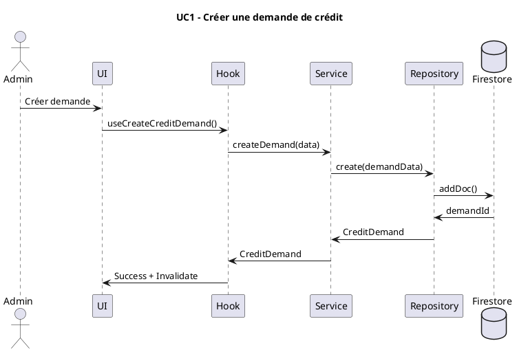
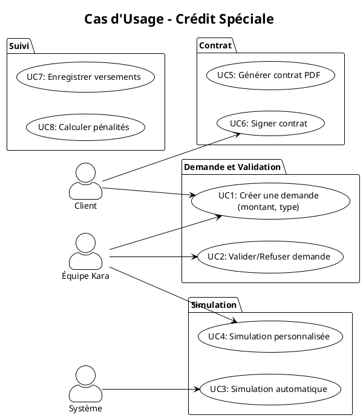

# Plan de Restructuration de l'Analyse UML

## 🎯 Objectif

Réduire la fragmentation excessive (137 fichiers .puml pour crédit-speciale) et créer une documentation UML claire, maintenable et cohérente.

---

## 📊 État Actuel (Problèmes identifiés)

### Fragmentation excessive
- **Crédit Spéciale** : 137 fichiers .puml (diagrams/UC_*.puml)
- **Placement** : Plusieurs fichiers éparpillés
- **Autres modules** : Documentation UML partielle ou absente

### Problèmes
1. **Trop de fichiers** : Difficile de trouver l'information
2. **Redondance** : Même information dans plusieurs fichiers
3. **Manque de vue d'ensemble** : Pas de diagramme global
4. **Incohérence** : Formats différents entre modules
5. **Maintenance difficile** : Modifications requièrent de toucher plusieurs fichiers

---

## ✅ Structure UML Proposée

### Principe : "Un fichier par type de diagramme, par domaine"

Chaque domaine aura **au maximum 4-5 fichiers UML** :

```
documentation/
└── domains/
    ├── membership/
    │   ├── DOMAIN_OVERVIEW.md           # Vue d'ensemble textuelle
    │   ├── CLASS_DIAGRAM.puml           # Diagramme de classes (1 fichier)
    │   ├── SEQUENCE_DIAGRAMS.puml       # Tous les diagrammes de séquence (1 fichier)
    │   └── USE_CASES.puml               # Tous les cas d'usage (1 fichier)
    │
    ├── financial/
    │   ├── caisse-speciale/
    │   │   ├── DOMAIN_OVERVIEW.md
    │   │   ├── CLASS_DIAGRAM.puml
    │   │   ├── SEQUENCE_DIAGRAMS.puml   # Tous les UC en 1 fichier
    │   │   └── USE_CASES.puml
    │   │
    │   ├── caisse-imprevue/
    │   │   └── (même structure)
    │   │
    │   ├── credit-speciale/
    │   │   ├── DOMAIN_OVERVIEW.md
    │   │   ├── CLASS_DIAGRAM.puml       # Remplace credit-speciale-classes.puml
    │   │   ├── SEQUENCE_DIAGRAMS.puml   # Remplace les 137 fichiers UC_*.puml
    │   │   └── USE_CASES.puml           # Remplace credit-speciale-usecases-*.puml
    │   │
    │   └── placement/
    │       └── (même structure)
    │
    ├── complementary/
    │   ├── vehicle/
    │   └── charity/
    │
    └── infrastructure/
        ├── geography/
        ├── documents/
        └── notifications/
```

**Résultat** : De 137 fichiers → 4-5 fichiers par domaine

---

## 📐 Structure d'un Fichier UML Consolidé

### Exemple : SEQUENCE_DIAGRAMS.puml

Au lieu d'avoir 137 fichiers séparés, on aura **1 fichier avec des sections** :



### Exemple : USE_CASES.puml

Un seul fichier avec tous les cas d'usage organisés par package :



---

## 🔄 Plan de Consolidation

### Phase 1 : Analyse et Inventaire (Semaine 1)

1. **Lister tous les fichiers UML existants**
   ```bash
   find documentation -name "*.puml" -type f | sort
   ```

2. **Grouper par domaine et type**
   - Diagrammes de classes
   - Diagrammes de séquence
   - Cas d'usage
   - Diagrammes de packages

3. **Identifier les redondances**
   - Mêmes diagrammes dans plusieurs fichiers
   - Informations dupliquées

4. **Créer un mapping**
   - Anciens fichiers → Nouveaux fichiers consolidés

### Phase 2 : Création de la Nouvelle Structure (Semaine 2)

1. **Créer la structure de dossiers**
   ```
   documentation/domains/
   ```

2. **Créer les fichiers DOMAIN_OVERVIEW.md** pour chaque domaine
   - Vue d'ensemble textuelle
   - Liste des entités
   - Liste des services
   - Cas d'usage principaux

3. **Consolider les diagrammes de classes**
   - 1 fichier CLASS_DIAGRAM.puml par domaine
   - Inclure toutes les entités du domaine

4. **Consolider les diagrammes de séquence**
   - 1 fichier SEQUENCE_DIAGRAMS.puml par domaine
   - Grouper par fonctionnalité (sections commentées)

5. **Consolider les cas d'usage**
   - 1 fichier USE_CASES.puml par domaine
   - Organiser par packages/fonctionnalités

### Phase 3 : Migration Progressive (Semaine 3-4)

**Stratégie** : Domaine par domaine, en commençant par le plus fragmenté

**Ordre suggéré** :
1. **Crédit Spéciale** (137 fichiers → 4 fichiers)
2. **Placement** (plusieurs fichiers → 4 fichiers)
3. **Caisse Spéciale** (déjà partiellement consolidé)
4. **Caisse Imprévue**
5. **Membership**
6. **Bienfaiteur**
7. **Infrastructure** (géographie, documents, notifications)

**Pour chaque domaine** :
1. Créer les nouveaux fichiers consolidés
2. Migrer le contenu des anciens fichiers
3. Supprimer les anciens fichiers
4. Mettre à jour les références dans la documentation

### Phase 4 : Validation et Documentation (Semaine 5)

1. **Valider les diagrammes**
   - Générer les images PNG depuis les .puml
   - Vérifier que tout compile
   - Vérifier que rien n'a été perdu

2. **Créer un index global**
   - Fichier `documentation/domains/README.md`
   - Liste de tous les domaines
   - Liens vers les diagrammes

3. **Mettre à jour l'architecture principale**
   - Référencer la nouvelle structure dans `ARCHITECTURE.md`

---

## 📋 Template pour DOMAIN_OVERVIEW.md

```markdown
# Domaine : [Nom du Domaine]

## Vue d'ensemble

[Description du domaine en 2-3 paragraphes]

## Responsabilités

- [Responsabilité 1]
- [Responsabilité 2]
- [Responsabilité 3]

## Entités Principales

### [Entité 1]
- **Description** : [Description]
- **Collections Firestore** : `collectionName`
- **Relations** : [Relations avec autres entités]

### [Entité 2]
...

## Services

### [ServiceName]
- **Responsabilité** : [Description]
- **Méthodes principales** :
  - `method1()` : [Description]
  - `method2()` : [Description]

## Cas d'usage Principaux

1. **UC1 : [Nom]**
   - **Acteur** : [Acteur]
   - **Description** : [Description]
   - **Diagramme** : Voir [USE_CASES.puml](./USE_CASES.puml#UC1)

2. **UC2 : [Nom]**
   ...

## Collections Firestore

| Collection | Description | Relations |
|------------|-------------|-----------|
| `collection1` | [Description] | [Relations] |
| `collection2` | [Description] | [Relations] |

## Dependencies (Domaines dépendants)

- **Infrastructure** : Géographie, Documents, Notifications
- **Membership** : Pour vérifier le statut des membres
- [Autres dépendances]

## Diagrammes UML

- **[CLASS_DIAGRAM.puml](./CLASS_DIAGRAM.puml)** : Structure des entités
- **[USE_CASES.puml](./USE_CASES.puml)** : Cas d'usage
- **[SEQUENCE_DIAGRAMS.puml](./SEQUENCE_DIAGRAMS.puml)** : Flux détaillés

## API Publique (Hooks/Services exposés)

### Hooks
- `use[Entity]List()` : Lister les entités
- `use[Entity](id)` : Récupérer une entité
- `useCreate[Entity]()` : Créer une entité
- `useUpdate[Entity]()` : Mettre à jour une entité

### Services (via ServiceFactory)
- `[Domain]Service.create[Entity]()`
- `[Domain]Service.update[Entity]()`
- ...

## Notes Techniques

[Notes spécifiques au domaine, contraintes, règles métier importantes]
```

---

## ✅ Checklist de Consolidation par Domaine

Pour chaque domaine à consolider :

- [ ] Créer `DOMAIN_OVERVIEW.md`
- [ ] Créer `CLASS_DIAGRAM.puml` (consolider tous les diagrammes de classes)
- [ ] Créer `SEQUENCE_DIAGRAMS.puml` (consolider tous les diagrammes de séquence)
- [ ] Créer `USE_CASES.puml` (consolider tous les cas d'usage)
- [ ] Générer les images PNG pour validation
- [ ] Supprimer les anciens fichiers .puml
- [ ] Mettre à jour les références dans la documentation
- [ ] Valider que rien n'a été perdu

---

## 🎯 Résultat Attendu

### Avant
```
documentation/credit-speciale/
├── credit-speciale-classes.puml
├── credit-speciale-usecases-*.puml (10+ fichiers)
├── diagrams/
│   ├── UC_Validation_sequence.puml
│   ├── UC_Validation_activity.puml
│   ├── UC_Validate_sequence.puml
│   ├── UC_Validate_activity.puml
│   ├── ... (133 autres fichiers)
│   └── UC_*.puml
```

### Après
```
documentation/domains/financial/credit-speciale/
├── DOMAIN_OVERVIEW.md
├── CLASS_DIAGRAM.puml
├── SEQUENCE_DIAGRAMS.puml
└── USE_CASES.puml
```

**Réduction** : 137+ fichiers → 4 fichiers

---

## 🚀 Actions Immédiates

### Cette semaine

1. **Créer la structure de dossiers**
   ```bash
   mkdir -p documentation/domains/{membership,financial,complementary,infrastructure}
   mkdir -p documentation/domains/financial/{caisse-speciale,caisse-imprevue,credit-speciale,placement}
   mkdir -p documentation/domains/complementary/{vehicle,charity}
   mkdir -p documentation/domains/infrastructure/{geography,documents,notifications,references}
   ```

2. **Commencer par le domaine le plus fragmenté** (Crédit Spéciale)
   - Créer `DOMAIN_OVERVIEW.md`
   - Identifier tous les diagrammes de classes à consolider
   - Identifier tous les diagrammes de séquence à consolider
   - Identifier tous les cas d'usage à consolider

3. **Créer un script d'inventaire**
   - Lister tous les fichiers .puml existants
   - Grouper par type et domaine

---

## 📚 Outils Recommandés

- **PlantUML** : Pour générer les diagrammes (déjà utilisé)
- **PlantUML Server** : Pour prévisualiser (http://www.plantuml.com/plantuml/uml/)
- **VS Code Extension** : "PlantUML" pour prévisualisation locale
- **Script de génération** : Pour automatiser la génération PNG depuis .puml

---

**Note** : Cette restructuration doit être faite progressivement, domaine par domaine, pour éviter de casser la documentation existante pendant la transition.
