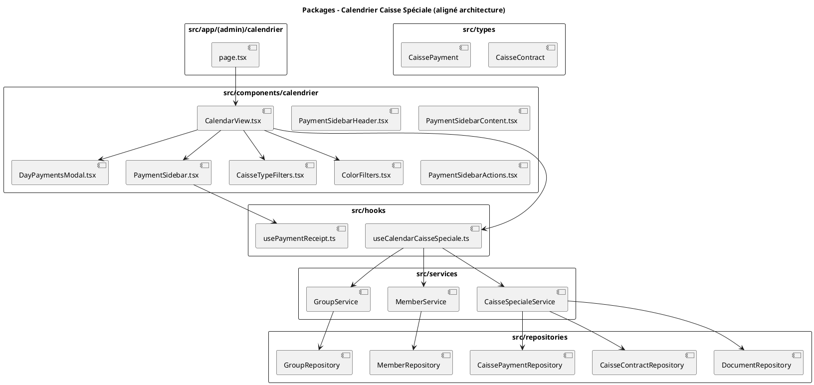
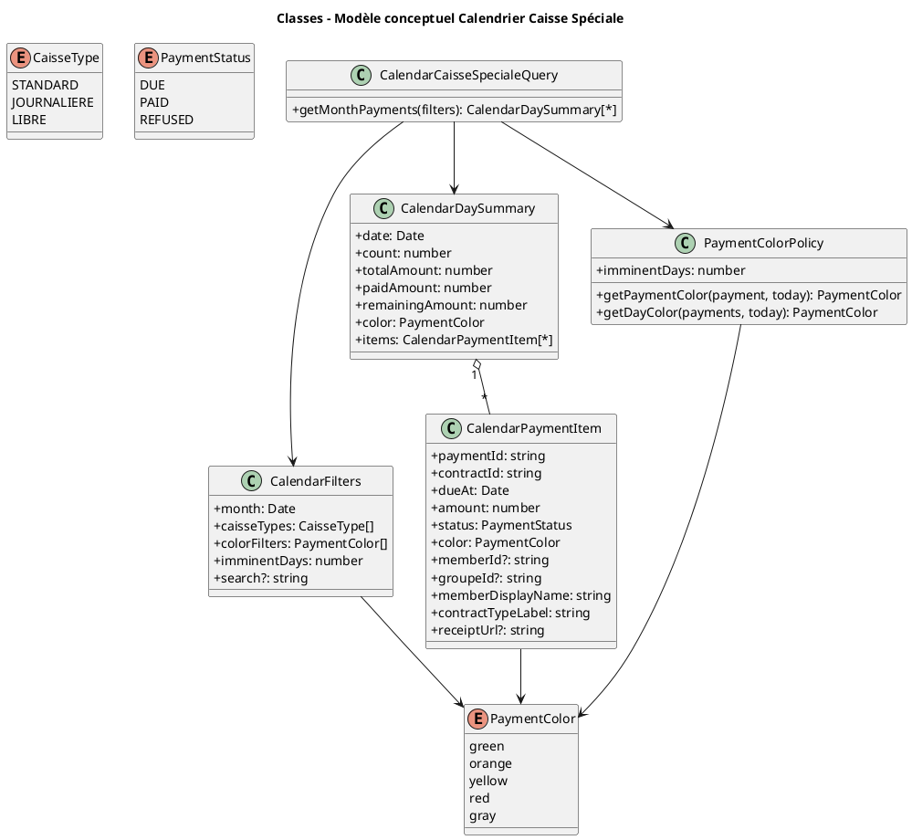
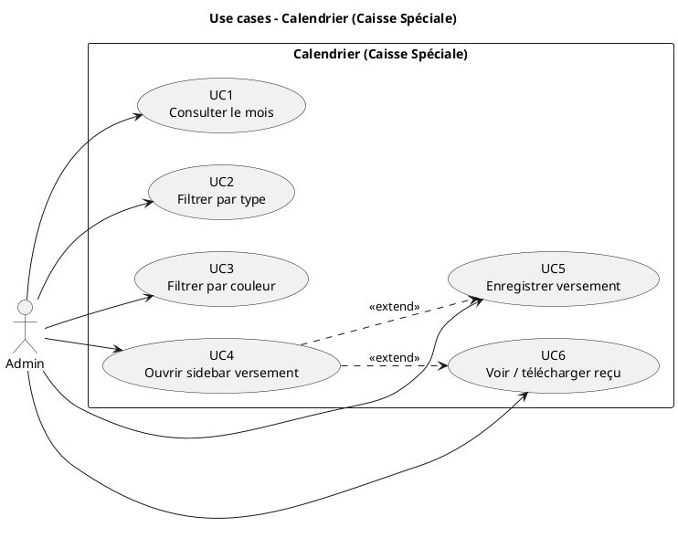
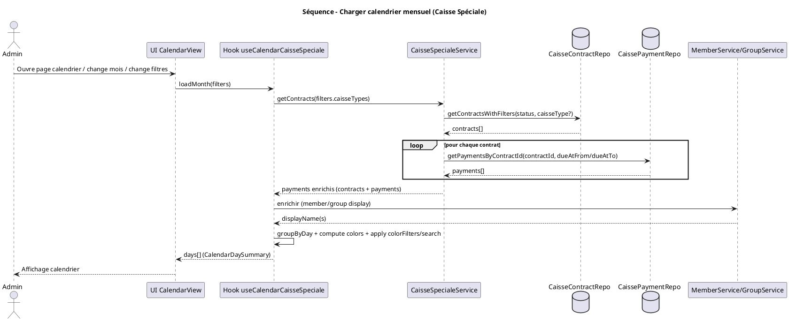
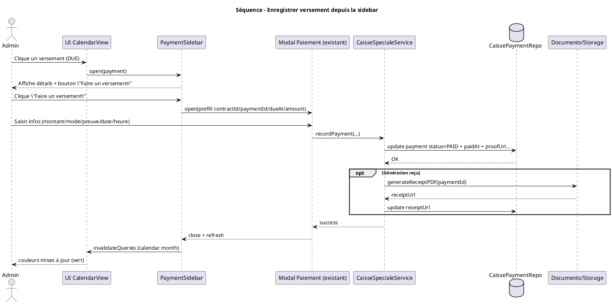
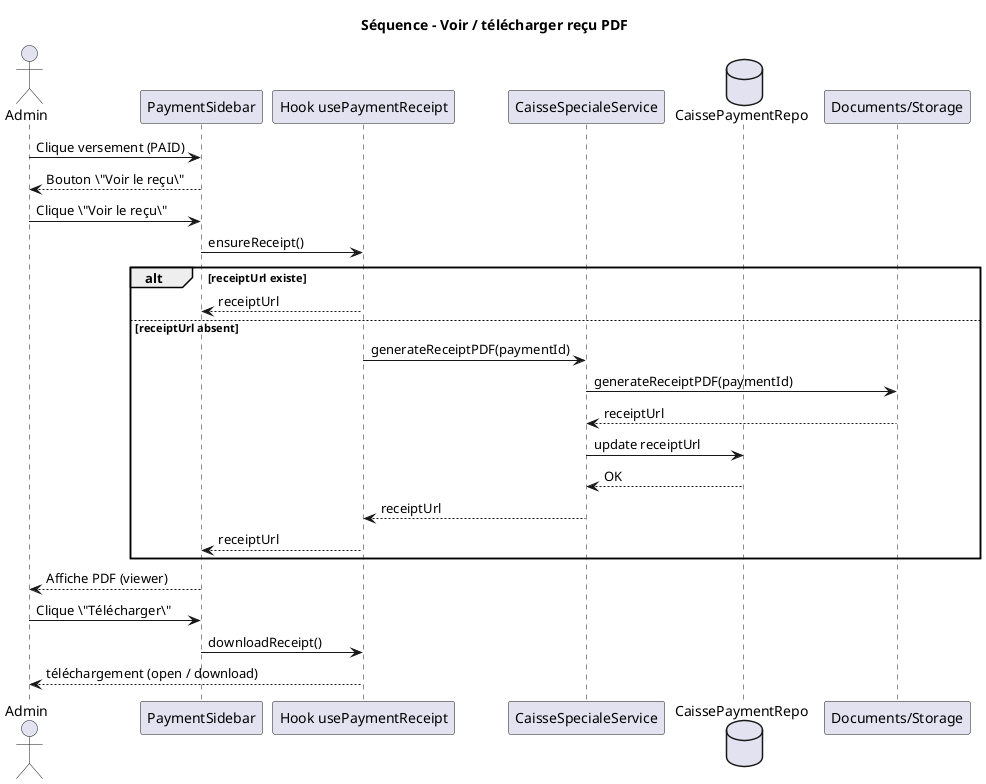
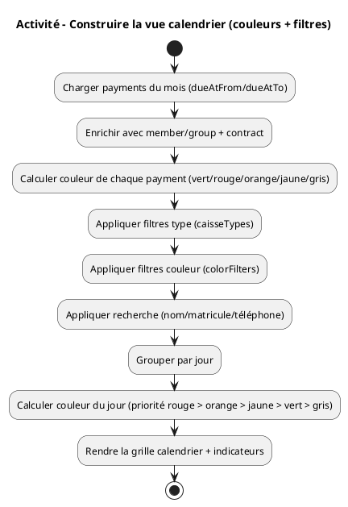

# Analyse – Calendrier des versements – Caisse Spéciale

## 1. Contexte et objectif

### Objectif principal
Créer une vue calendrier mensuelle permettant de visualiser et gérer tous les versements à effectuer pour les contrats de caisse spéciale, avec la possibilité de filtrer par type de contrat (journalier, standard, libre).

### Périmètre
- Module : Caisse Spéciale
- Types de contrats : `JOURNALIERE`, `STANDARD`, `LIBRE`
- Vue : Calendrier mensuel avec filtres par type de contrat
- Fonctionnalités : Visualisation des versements, filtrage par type, enregistrement de paiements depuis le calendrier

---

## 2. Structure des données

### 2.1 Contrats de Caisse Spéciale (CaisseContract)

Les contrats de caisse spéciale sont caractérisés par leur type :

```typescript
interface CaisseContract {
  id: string
  memberId?: string        // Pour les contrats individuels
  groupeId?: string        // Pour les contrats de groupe
  contractType: 'INDIVIDUAL' | 'GROUP'
  caisseType: 'STANDARD' | 'JOURNALIERE' | 'LIBRE' // Type de caisse
  monthlyAmount: number
  monthsPlanned: number
  status: CaisseContractStatus
  nextDueAt?: Date         // Prochaine date d'échéance (clé pour le calendrier)
  currentMonthIndex: number
  nominalPaid: number
  bonusAccrued: number
  penaltiesTotal: number
  contractStartAt?: Date
  contractEndAt?: Date
  createdAt: Date
  updatedAt: Date
}
```

### 2.2 Versements (CaissePayment)

Les versements sont stockés dans une sous-collection `payments` de chaque contrat :

```typescript
interface CaissePayment {
  id: string
  contractId: string       // ID du contrat parent
  dueMonthIndex: number
  dueAt: Date             // Date d'échéance (clé pour le calendrier)
  paidAt?: Date
  amount: number
  penaltyApplied?: number
  penaltyDays?: number
  status: 'DUE' | 'PAID' | 'REFUSED'
  proofUrl?: string
  createdAt: Date
  updatedAt: Date
  updatedBy?: string
  time?: string
  mode?: PaymentMode
  // Extensions pour journalière/libre
  accumulatedAmount?: number
  contribs?: IndividualPaymentContribution[]
  targetAmount?: number
  // Extensions pour les contrats de groupe
  isGroupPayment?: boolean
  groupContributions?: GroupPaymentContribution[]
}
```

### 2.3 Types de contrats

#### Contrats Journaliers (`JOURNALIERE`)
- **Fréquence** : Versements quotidiens
- **Caractéristiques** : 
  - Versements fréquents (tous les jours)
  - Montant mensuel divisé sur plusieurs jours
  - Peut avoir des contributions multiples (`contribs`)
- **Affichage par défaut** : Oui (par défaut dans le calendrier)

#### Contrats Standard (`STANDARD`)
- **Fréquence** : Versements mensuels
- **Caractéristiques** :
  - Versement mensuel unique
  - Montant fixe par mois
  - Structure plus simple
- **Affichage** : Via filtre switch

#### Contrats Libres (`LIBRE`)
- **Fréquence** : Versements flexibles
- **Caractéristiques** :
  - Versements selon accord avec le membre
  - Montants et dates variables
  - Plus de flexibilité dans les paiements
- **Affichage** : Via filtre switch

---

## 3. Analyse fonctionnelle

### 3.1 Affichage du calendrier mensuel

#### Vue calendrier par défaut
- **Type affiché par défaut** : Contrats `JOURNALIERE` uniquement
- **Format** : Calendrier mensuel classique (grille 7 jours × ~5 semaines)
- **Navigation** : Mois précédent/suivant, sélection de mois/année
- **Affichage par jour** :
  - Nombre de versements (badge avec compteur)
  - Montant total des versements du jour
  - **Indicateur visuel selon le statut et la date** :
    - 🟢 **Vert** : Versements enregistrés (payés)
      - Condition : `status === 'PAID'`
      - Signification : Le versement a été complètement enregistré
    - 🟠 **Orange** : Versements imminents (à l’approche du jour de paiement)
      - Condition : `status === 'DUE'` ET `dueAt >= aujourd'hui` ET `dueAt <= aujourd'hui + N jours`
      - Exemple : On est le 13, un versement prévu le 13 / 14 / 15 (si \(N=2\)) sera en orange
      - Signification : Versements très proches, à traiter en priorité
    - 🟡 **Jaune** : Versements à venir (non encore imminents)
      - Condition : `status === 'DUE'` ET `dueAt > aujourd'hui + N jours`
      - Exemple : On est le 13, un versement prévu le 20 (si \(N=2\)) sera en jaune
      - Signification : Versements prévus mais pas encore urgents
    - 🔴 **Rouge** : Versements en retard (passés et non enregistrés)
      - Condition : `status === 'DUE'` ET `dueAt < aujourd'hui` (date d'échéance < date du jour)
      - Exemple : On est le 13, il y avait 2 versements prévus le 12 qui n'ont pas été enregistrés → ils seront en rouge
      - Signification : Versements qui auraient dû être payés mais qui ne l'ont pas été
    - ⚪ **Gris** : Versements refusés ou annulés
      - Condition : `status === 'REFUSED'`
      - Signification : Versements refusés par le membre

#### Filtres par type de contrat

**Composant de filtrage** : Switches/Toggles pour chaque type

```
┌─────────────────────────────────────────┐
│  Filtres par type de contrat           │
├─────────────────────────────────────────┤
│  ☑ Journaliers (par défaut)           │
│  ☐ Standard                            │
│  ☐ Libre                               │
└─────────────────────────────────────────┘
```

**Comportement** :
- Par défaut : Seul "Journaliers" est activé
- L'utilisateur peut activer/désactiver chaque type indépendamment
- Plusieurs types peuvent être affichés simultanément
- Le calendrier se met à jour automatiquement lors du changement de filtre

#### Filtres par couleur (statut)

**Objectif** : pouvoir afficher/masquer les versements selon leur état (payé / en retard / imminent / à venir).

**Composant de filtrage** : chips / switches (multi-sélection), par exemple :

- ☑ Payés (🟢)
- ☑ En retard (🔴)
- ☑ Imminents (🟠) *(\(N\) jours avant échéance, configurable)*
- ☑ À venir (🟡)
- ☐ Refusés (⚪) *(souvent masqué par défaut)*

**Règle de couleur (rappel)** :
- 🟢 `PAID`
- 🔴 `DUE` et `dueAt < aujourd’hui`
- 🟠 `DUE` et `dueAt ∈ [aujourd’hui ; aujourd’hui + N jours]`
- 🟡 `DUE` et `dueAt > aujourd’hui + N jours`
- ⚪ `REFUSED`

#### Changement de mois (passé / futur)

Comme c’est un calendrier, l’admin peut naviguer sur les **mois passés** et **mois futurs** :
- **Portée des données** : on charge uniquement les versements dont `dueAt` est **dans le mois affiché** (filtre `dueAtFrom` / `dueAtTo`).
- **Couleurs** : elles restent calculées **par rapport à la date du jour** (today). Donc :
  - Sur un mois passé : les versements non payés apparaîtront majoritairement en **rouge**.
  - Sur un mois futur : les versements non payés apparaîtront en **jaune/orange** selon le seuil \(N\).

#### Données à afficher par jour

Pour chaque jour du mois, afficher :
- Nombre de versements (`count`)
- Montant total des versements (`totalAmount`)
- Montant total déjà payé (`paidAmount`)
- Montant restant (`remainingAmount`)
- Liste des versements avec :
  - Nom du membre (ou groupe)
  - Type de contrat (`JOURNALIERE`, `STANDARD`, `LIBRE`)
  - Montant du versement
  - Statut
  - Numéro de mois (`dueMonthIndex`)

### 3.2 Récupération des données

#### Requête pour un mois donné avec filtres

```typescript
// Exemple : récupérer tous les contrats actifs pour janvier 2024
// Filtrer par type de caisse selon les filtres sélectionnés

interface CalendarFilters {
  month: Date                    // Mois à afficher
  caisseTypes: CaisseType[]      // Types sélectionnés : ['JOURNALIERE'] par défaut
}

// Étape 1 : Récupérer les contrats avec les types sélectionnés
const contracts = await caisseContractRepository.getContractsWithFilters({
  caisseType: filters.caisseTypes.length === 1 
    ? filters.caisseTypes[0] 
    : undefined, // Si plusieurs types, ne pas filtrer au niveau du repository
  status: ['ACTIVE', 'LATE_NO_PENALTY', 'LATE_WITH_PENALTY'], // Contrats actifs
  // Filtrer ensuite côté client si plusieurs types
})

// Filtrer par types si plusieurs sélectionnés
const filteredContracts = contracts.filter(c => 
  filters.caisseTypes.includes(c.caisseType)
)

// Étape 2 : Pour chaque contrat, récupérer les versements du mois
const monthStart = startOfMonth(filters.month)
const monthEnd = endOfMonth(filters.month)

const payments: Array<CaissePayment & { contract: CaisseContract }> = []

for (const contract of filteredContracts) {
  // Récupérer les versements du contrat pour le mois
  const contractPayments = await caissePaymentRepository.getPaymentsByContractId(
    contract.id,
    {
      dueAtFrom: monthStart,
      dueAtTo: monthEnd
    }
  )
  
  // Enrichir avec les informations du contrat
  payments.push(...contractPayments.map(p => ({
    ...p,
    contract
  })))
}

// Étape 3 : Grouper par jour
const groupedByDay = groupPaymentsByDay(payments)
```

#### Enrichissement des données

Pour chaque versement, il faut récupérer :
1. Les informations du contrat (`CaisseContract`) pour obtenir le type de caisse
2. Les informations du membre (`Member`) pour l'affichage du nom
3. Les informations du groupe (`Group`) si `contractType === 'GROUP'`

#### Groupement par jour

```typescript
interface DayPayments {
  date: Date
  payments: Array<CaissePayment & { contract: CaisseContract }>
  totalAmount: number
  paidAmount: number
  remainingAmount: number
  count: number
  statuses: ('DUE' | 'PAID' | 'REFUSED')[]
  caisseTypes: CaisseType[] // Types de contrats présents ce jour
  color: 'green' | 'orange' | 'yellow' | 'red' | 'gray' // Couleur du jour selon la logique métier
}

// Fonction pour calculer la couleur d'un jour
function calculateDayColor(
  payments: Array<CaissePayment & { contract: CaisseContract }>,
  today: Date
): 'green' | 'orange' | 'yellow' | 'red' | 'gray' {
  if (payments.length === 0) return 'gray'
  
  const todayStart = startOfDay(today)
  const IMMINENT_DAYS = 2 // configurable (ex: 0 = seulement aujourd'hui, 2 = J+2, 3 = J+3)
  
  // Vérifier s'il y a des versements en retard (rouge)
  const hasOverdue = payments.some(p => 
    p.status === 'DUE' && 
    startOfDay(p.dueAt) < todayStart
  )
  if (hasOverdue) return 'red'

  // Vérifier s'il y a des versements imminents (orange)
  const hasImminent = payments.some(p => {
    if (p.status !== 'DUE') return false
    const dueStart = startOfDay(p.dueAt)
    const diffDays = Math.floor((dueStart.getTime() - todayStart.getTime()) / (1000 * 60 * 60 * 24))
    return diffDays >= 0 && diffDays <= IMMINENT_DAYS
  })
  if (hasImminent) return 'orange'

  // Vérifier s'il y a des versements à venir (jaune)
  const hasUpcoming = payments.some(p => {
    if (p.status !== 'DUE') return false
    const dueStart = startOfDay(p.dueAt)
    const diffDays = Math.floor((dueStart.getTime() - todayStart.getTime()) / (1000 * 60 * 60 * 24))
    return diffDays > IMMINENT_DAYS
  })
  if (hasUpcoming) return 'yellow'
  
  // Vérifier si tous les versements sont payés (vert)
  const allPaid = payments.every(p => p.status === 'PAID')
  if (allPaid) return 'green'
  
  // Vérifier si tous les versements sont refusés (gris)
  const allRefused = payments.every(p => p.status === 'REFUSED')
  if (allRefused) return 'gray'
  
  // Par défaut : jaune
  return 'yellow'
}

// Grouper les versements par jour
const today = new Date()
const groupedByDay = payments.reduce((acc, payment) => {
  const dayKey = format(payment.dueAt, 'yyyy-MM-dd')
  if (!acc[dayKey]) {
    acc[dayKey] = {
      date: payment.dueAt,
      payments: [],
      totalAmount: 0,
      paidAmount: 0,
      remainingAmount: 0,
      count: 0,
      statuses: [],
      caisseTypes: [],
      color: 'gray' // Sera calculé après le groupement
    }
  }
  
  acc[dayKey].payments.push(payment)
  acc[dayKey].totalAmount += payment.amount
  if (payment.status === 'PAID') {
    acc[dayKey].paidAmount += payment.amount
  } else {
    acc[dayKey].remainingAmount += payment.amount
  }
  acc[dayKey].count++
  acc[dayKey].statuses.push(payment.status)
  
  if (!acc[dayKey].caisseTypes.includes(payment.contract.caisseType)) {
    acc[dayKey].caisseTypes.push(payment.contract.caisseType)
  }
  
  return acc
}, {} as Record<string, DayPayments>)

// Calculer la couleur pour chaque jour
Object.values(groupedByDay).forEach(day => {
  day.color = calculateDayColor(day.payments, today)
})
```

### 3.3 Interaction avec le calendrier

#### Clic sur un jour
Lorsqu'on clique sur un jour du calendrier :
1. Ouvrir un modal ou un panneau latéral avec la liste des versements du jour
2. Afficher la liste détaillée des versements de ce jour
3. Grouper par type de contrat (Journaliers, Standard, Libre)
4. Pour chaque versement dans la liste, afficher :
   - Nom du membre (ou groupe)
   - Type de contrat avec badge coloré
   - Montant du versement (`amount`)
   - **Badge de couleur** selon le statut (vert/orange/jaune/rouge/gris)
   - Numéro de mois (`dueMonthIndex`)
   - Date d'échéance (`dueAt`)

#### Clic sur un versement individuel
Lorsqu'on clique sur un versement individuel (depuis la liste du jour ou directement depuis le calendrier) :
1. **Ouvrir une sidebar à droite** qui s'affiche avec animation
2. **Structure de la sidebar** en 3 zones :

##### Zone 1 : En-tête fixe (top-0, position fixed)
**Informations du membre et du contrat**
- Photo du membre (si disponible)
- Nom complet du membre (ou groupe)
- Matricule du membre
- Contacts du membre
- **Informations du contrat** :
  - Type de contrat (Journalier/Standard/Libre) avec badge
  - ID du contrat
  - Statut du contrat
  - Montant mensuel (`monthlyAmount`)
  - Mois en cours (`currentMonthIndex` / `monthsPlanned`)

##### Zone 2 : Contenu scrollable (middle)
**Détails sur le versement et le contrat**
- **Informations du versement** :
  - Date d'échéance (`dueAt`)
  - Montant du versement (`amount`)
  - Statut avec badge coloré
  - Numéro de mois (`dueMonthIndex`)
  - Date de paiement (`paidAt`) si payé
  - Moyen de paiement (`mode`) si payé
  - Pénalités appliquées (`penaltyApplied`) si applicable
  - Nombre de jours de retard (`penaltyDays`) si applicable
- **Historique des versements** (liste scrollable) :
  - Versements précédents du contrat
  - Versements suivants prévus
  - Statistiques du contrat (montant total payé, bonus, pénalités)

##### Zone 3 : Actions fixes (bottom-0, position fixed/absolute)
**Bouton d'action principal**
- **Si versement non payé** (`status !== 'PAID'`) :
  - Bouton "Faire un versement" (couleur primaire)
  - Au clic : Ouvrir le formulaire d'enregistrement de paiement
- **Si versement payé** (`status === 'PAID'`) :
  - Bouton "Voir le reçu" (couleur secondaire)
  - Au clic : Afficher le reçu PDF dans la zone scrollable
  - Bouton "Télécharger le reçu PDF" (icône de téléchargement)
  - Utiliser la fonctionnalité existante de génération/téléchargement de reçu

#### Enregistrement d'un paiement depuis la sidebar
1. Clic sur "Faire un versement" dans la sidebar
2. Ouvrir le modal de paiement existant (selon le type de contrat)
3. Pré-remplir :
   - `contractId` : ID du contrat
   - `paymentId` : ID du versement (si modification)
   - Date suggérée : date d'échéance du versement ou date du jour
   - Montant suggéré : montant restant du versement
4. L'admin saisit les informations du paiement (montant, moyen, preuve, etc.)
5. Après enregistrement :
   - Fermer le modal
   - Rafraîchir la sidebar (mettre à jour les informations)
   - Rafraîchir le calendrier
   - Mettre à jour les indicateurs visuels
   - Afficher une notification de succès
   - Le bouton passe de "Faire un versement" à "Voir le reçu"

#### Affichage du reçu PDF dans la sidebar
1. Clic sur "Voir le reçu" pour un versement payé
2. **Afficher le reçu dans la zone scrollable** :
   - Intégrer un viewer PDF (iframe ou composant PDF viewer)
   - Afficher le reçu depuis `receiptUrl` du paiement
   - Si le reçu n'existe pas encore, le générer automatiquement
3. **Bouton de téléchargement** :
   - Toujours visible dans la zone d'actions (bottom)
   - Permet de télécharger le reçu en PDF
   - Utiliser la fonctionnalité existante de téléchargement

---

## 4. Structure technique

### 4.1 Composants à créer

#### `CalendarView.tsx`
Composant principal du calendrier avec :
- Navigation mois/année
- Grille calendrier
- Filtres par type de contrat (switches)
- Gestion des clics sur les jours
- Intégration avec les hooks de données

#### `CaisseTypeFilters.tsx`
Composant pour les filtres par type :
- Switches pour chaque type (`JOURNALIERE`, `STANDARD`, `LIBRE`)
- État par défaut : `JOURNALIERE` activé
- Gestion de l'état des filtres
- Callback pour notifier les changements

#### `CalendarDay.tsx`
Composant pour afficher un jour du calendrier :
- Badge avec compteur de versements
- **Indicateur visuel de couleur** :
  - Fond ou bordure colorée selon `dayPayments.color`
  - 🟢 Vert : Tous les versements payés
  - 🟠 Orange : Versements imminents (date proche, \(N\) jours)
  - 🟡 Jaune : Versements à venir (date future)
  - 🔴 Rouge : Versements en retard (date < aujourd'hui)
  - ⚪ Gris : Versements refusés ou aucun versement
- Montant total affiché
- Badge indiquant les types de contrats présents
- Gestion du clic avec feedback visuel

#### `DayPaymentsModal.tsx`
Modal affichant les versements d'un jour :
- Liste des versements groupés par type de contrat
- Informations détaillées par versement
- **Badge de couleur pour chaque versement** selon la logique :
  - Fonction utilitaire `getPaymentColor(payment: CaissePayment, today: Date)` :
    ```typescript
    function getPaymentColor(payment: CaissePayment, today: Date): 'green' | 'orange' | 'yellow' | 'red' | 'gray' {
      const IMMINENT_DAYS = 2 // configurable
      if (payment.status === 'PAID') return 'green'
      if (payment.status === 'REFUSED') return 'gray'
      if (payment.status === 'DUE') {
        const todayStart = startOfDay(today)
        const dueDateStart = startOfDay(payment.dueAt)
        if (dueDateStart < todayStart) return 'red'
        const diffDays = Math.floor((dueDateStart.getTime() - todayStart.getTime()) / (1000 * 60 * 60 * 24))
        return diffDays <= IMMINENT_DAYS ? 'orange' : 'yellow'
      }
      return 'gray'
    }
    ```
- Clic sur un versement → ouvre `PaymentSidebar`

#### `PaymentSidebar.tsx`
Sidebar à droite affichant les détails d'un versement :

**Structure en 3 zones** :

1. **Zone en-tête (top-0, position fixed)**
   - Composant `PaymentSidebarHeader.tsx`
   - Informations du membre :
     - Photo du membre (avatar)
     - Nom complet
     - Matricule
     - Contacts (téléphone, email)
   - Informations du contrat :
     - Type de contrat avec badge (Journalier/Standard/Libre)
     - ID du contrat
     - Statut du contrat
     - Montant mensuel
     - Progression (mois en cours / mois prévus)

2. **Zone contenu (middle, scrollable)**
   - Composant `PaymentSidebarContent.tsx`
   - Détails du versement :
     - Date d'échéance
     - Montant du versement
     - Statut avec badge coloré
     - Date de paiement (si payé)
     - Moyen de paiement (si payé)
     - Pénalités (si applicable)
   - Historique des versements :
     - Liste des versements précédents
     - Versements suivants prévus
   - Statistiques du contrat :
     - Montant total payé
     - Bonus accumulé
     - Pénalités totales
   - **Affichage du reçu PDF** (si versement payé et "Voir le reçu" cliqué) :
     - Viewer PDF intégré (iframe ou composant PDF)
     - Affichage depuis `receiptUrl` du paiement
     - Génération automatique si le reçu n'existe pas

3. **Zone actions (bottom-0, position fixed/absolute)**
   - Composant `PaymentSidebarActions.tsx`
   - **Bouton conditionnel** :
     - Si `status !== 'PAID'` : Bouton "Faire un versement"
       - Ouvre le modal de paiement existant
     - Si `status === 'PAID'` : Bouton "Voir le reçu"
       - Affiche le reçu PDF dans la zone scrollable
       - Bouton "Télécharger le reçu PDF" (icône de téléchargement)
       - Utilise la fonctionnalité existante de téléchargement

**Fonctionnalités** :
- Animation d'ouverture/fermeture (slide depuis la droite)
- Overlay pour fermer la sidebar (clic en dehors)
- Bouton de fermeture (X) en haut à droite
- Responsive : s'adapte sur mobile (plein écran ou drawer)

### 4.2 Hooks à créer

#### `useCalendarPayments(month: Date, caisseTypes: CaisseType[])`
Hook pour récupérer les versements d'un mois avec filtres :

```typescript
function useCalendarPayments(month: Date, caisseTypes: CaisseType[]) {
  const filters = useMemo(() => ({
    monthStart: startOfMonth(month),
    monthEnd: endOfMonth(month),
    caisseTypes
  }), [month, caisseTypes])
  
  return useQuery({
    queryKey: ['calendar-payments', format(month, 'yyyy-MM'), caisseTypes.join(',')],
    queryFn: async () => {
      // 1. Récupérer les contrats avec les types sélectionnés
      const contracts = await caisseContractRepository.getContractsWithFilters({
        status: ['ACTIVE', 'LATE_NO_PENALTY', 'LATE_WITH_PENALTY']
      })
      
      // Filtrer par types
      const filteredContracts = contracts.filter(c => 
        caisseTypes.includes(c.caisseType)
      )
      
      // 2. Récupérer les versements pour chaque contrat
      const payments: Array<CaissePayment & { contract: CaisseContract }> = []
      
      for (const contract of filteredContracts) {
        const contractPayments = await caissePaymentRepository.getPaymentsByContractId(
          contract.id,
          {
            dueAtFrom: filters.monthStart,
            dueAtTo: filters.monthEnd
          }
        )
        
        payments.push(...contractPayments.map(p => ({
          ...p,
          contract
        })))
      }
      
      // 3. Enrichir avec les données des membres
      // 4. Grouper par jour
      return groupPaymentsByDay(payments)
    },
    staleTime: 5 * 60 * 1000, // 5 minutes
  })
}
```

#### `useGroupedPaymentsByDay(payments: CaissePayment[])`
Hook pour grouper les versements par jour :

```typescript
function useGroupedPaymentsByDay(
  payments: Array<CaissePayment & { contract: CaisseContract }>
) {
  return useMemo(() => {
    // Logique de groupement par jour
    // Enrichissement avec les données des membres
    return groupedPayments
  }, [payments])
}
```

### 4.3 Services existants à réutiliser

- `CaisseSpecialeService.recordPayment()` : Pour enregistrer un paiement
- `CaisseContractRepository.getContractsWithFilters()` : Pour récupérer les contrats
- `CaissePaymentRepository.getPaymentsByContractId()` : Pour récupérer les versements
- **Services de génération/téléchargement de reçu PDF** :
  - Fonctionnalité existante dans les modules pour générer les reçus PDF
  - Fonctionnalité existante pour télécharger les reçus PDF
  - Réutiliser `receiptUrl` du paiement pour afficher le reçu
  - Si `receiptUrl` n'existe pas, utiliser le service de génération de reçu existant

### 4.4 Structure de la sidebar

#### Layout de la sidebar

```typescript
<div className="fixed inset-y-0 right-0 w-full md:w-96 bg-white shadow-xl z-50 flex flex-col">
  {/* Zone 1 : En-tête fixe (top-0) */}
  <div className="fixed top-0 right-0 w-full md:w-96 bg-white border-b z-10">
    <PaymentSidebarHeader 
      member={member}
      contract={contract}
      onClose={() => setSelectedPayment(null)}
    />
  </div>
  
  {/* Zone 2 : Contenu scrollable (middle) */}
  <div className="flex-1 overflow-y-auto pt-[header-height] pb-[actions-height]">
    <PaymentSidebarContent 
      payment={payment}
      contract={contract}
      paymentHistory={paymentHistory}
      showReceipt={showReceipt}
    />
  </div>
  
  {/* Zone 3 : Actions fixes (bottom-0) */}
  <div className="fixed bottom-0 right-0 w-full md:w-96 bg-white border-t z-10">
    <PaymentSidebarActions 
      payment={payment}
      onRecordPayment={() => openPaymentModal()}
      onViewReceipt={() => setShowReceipt(true)}
      onDownloadReceipt={() => downloadReceipt()}
    />
  </div>
</div>
```

#### Gestion du reçu PDF

```typescript
// Hook pour gérer l'affichage et le téléchargement du reçu
function usePaymentReceipt(payment: CaissePayment) {
  const [receiptUrl, setReceiptUrl] = useState<string | null>(payment.receiptUrl || null)
  const [isGenerating, setIsGenerating] = useState(false)
  
  const generateReceipt = async () => {
    if (receiptUrl) return receiptUrl
    
    setIsGenerating(true)
    try {
      // Utiliser le service existant de génération de reçu
      const url = await caisseSpecialeService.generateReceiptPDF(payment.id)
      setReceiptUrl(url)
      return url
    } catch (error) {
      console.error('Erreur lors de la génération du reçu:', error)
      throw error
    } finally {
      setIsGenerating(false)
    }
  }
  
  const downloadReceipt = async () => {
    const url = receiptUrl || await generateReceipt()
    // Utiliser la fonctionnalité existante de téléchargement
    window.open(url, '_blank')
    // Ou utiliser un service de téléchargement
    // await downloadFile(url, `receipt_${payment.id}.pdf`)
  }
  
  return {
    receiptUrl,
    isGenerating,
    generateReceipt,
    downloadReceipt
  }
}
```

---

## 5. Logique métier

### 5.1 Calcul du statut d'un jour

Un jour peut avoir plusieurs versements avec différents statuts. Le statut visuel du jour est déterminé par la **priorité suivante** :

#### Logique de détermination de la couleur

```typescript
function getDayColor(payments: CaissePayment[], today: Date): 'green' | 'orange' | 'yellow' | 'red' | 'gray' {
  const todayStart = startOfDay(today)
  const IMMINENT_DAYS = 2 // configurable
  
  // Vérifier s'il y a des versements en retard (rouge)
  const hasOverdue = payments.some(p => 
    p.status === 'DUE' && 
    startOfDay(p.dueAt) < todayStart
  )
  if (hasOverdue) return 'red'
  
  // Vérifier s'il y a des versements imminents (orange)
  const hasImminent = payments.some(p => {
    if (p.status !== 'DUE') return false
    const dueStart = startOfDay(p.dueAt)
    const diffDays = Math.floor((dueStart.getTime() - todayStart.getTime()) / (1000 * 60 * 60 * 24))
    return diffDays >= 0 && diffDays <= IMMINENT_DAYS
  })
  if (hasImminent) return 'orange'

  // Vérifier s'il y a des versements à venir (jaune)
  const hasUpcoming = payments.some(p => {
    if (p.status !== 'DUE') return false
    const dueStart = startOfDay(p.dueAt)
    const diffDays = Math.floor((dueStart.getTime() - todayStart.getTime()) / (1000 * 60 * 60 * 24))
    return diffDays > IMMINENT_DAYS
  })
  if (hasUpcoming) return 'yellow'
  
  // Vérifier si tous les versements sont payés (vert)
  const allPaid = payments.length > 0 && payments.every(p => p.status === 'PAID')
  if (allPaid) return 'green'
  
  // Vérifier si tous les versements sont refusés (gris)
  const allRefused = payments.length > 0 && payments.every(p => p.status === 'REFUSED')
  if (allRefused) return 'gray'
  
  // Par défaut : jaune si des versements existent
  return payments.length > 0 ? 'yellow' : 'gray'
}
```

#### Priorité des couleurs

1. **🔴 Rouge (Priorité 1)** : En retard
   - Condition : Au moins un versement avec `status === 'DUE'` ET `dueAt < aujourd'hui`
   - Exemple : On est le 13 janvier, il y a 2 versements prévus le 12 janvier qui n'ont pas été enregistrés → le jour du 12 sera en rouge
   - Signification : Action requise immédiatement

2. **🟠 Orange (Priorité 2)** : Imminent (à l’approche)
   - Condition : Au moins un versement `DUE` avec `dueAt ∈ [aujourd’hui ; aujourd’hui + N jours]`
   - Signification : À traiter en priorité dans les prochains jours

3. **🟡 Jaune (Priorité 3)** : À venir
   - Condition : Au moins un versement `DUE` avec `dueAt > aujourd'hui + N jours`
   - Signification : Versements prévus mais pas encore urgents

4. **🟢 Vert (Priorité 4)** : Payé
   - Condition : Tous les versements ont `status === 'PAID'`
   - Signification : Tous les versements du jour ont été enregistrés

5. **⚪ Gris (Par défaut)** : Refusé ou aucun versement
   - Condition : Tous les versements ont `status === 'REFUSED'` OU aucun versement
   - Signification : Versements refusés ou jour sans versement

#### Exemples concrets

**Exemple 1 : Jour avec versements mixtes**
- Date : 12 janvier
- Aujourd'hui : 13 janvier
- Versements :
  - Versement 1 : `dueAt = 12 janvier`, `status = 'DUE'` → En retard
  - Versement 2 : `dueAt = 12 janvier`, `status = 'PAID'` → Payé
- **Résultat** : 🔴 Rouge (priorité au versement en retard)

**Exemple 2 : Jour avec versements à venir**
- Date : 15 janvier
- Aujourd'hui : 13 janvier
- Versements :
  - Versement 1 : `dueAt = 15 janvier`, `status = 'DUE'` → À venir
- **Résultat** : 🟠 Orange si \(N \ge 2\), sinon 🟡 Jaune

**Exemple 3 : Jour avec tous les versements payés**
- Date : 10 janvier
- Aujourd'hui : 13 janvier
- Versements :
  - Versement 1 : `dueAt = 10 janvier`, `status = 'PAID'` → Payé
  - Versement 2 : `dueAt = 10 janvier`, `status = 'PAID'` → Payé
- **Résultat** : 🟢 Vert (tous payés)

**Exemple 4 : Jour avec versements en retard multiples**
- Date : 12 janvier
- Aujourd'hui : 13 janvier
- Versements :
  - Versement 1 (Contrat A) : `dueAt = 12 janvier`, `status = 'DUE'` → En retard
  - Versement 2 (Contrat B) : `dueAt = 12 janvier`, `status = 'DUE'` → En retard
- **Résultat** : 🔴 Rouge (les 2 versements sont en retard)

### 5.2 Filtrage par type de contrat

#### Comportement des filtres
- **Par défaut** : Seul `JOURNALIERE` est activé
- **Sélection multiple** : L'utilisateur peut activer plusieurs types simultanément
- **Désélection** : Si tous les filtres sont désactivés, afficher un message "Aucun filtre sélectionné"
- **Mise à jour** : Le calendrier se met à jour automatiquement lors du changement de filtre

#### Filtres par statut (optionnel)
En plus des filtres par type, on peut ajouter :
- Tous les versements
- Versements à venir uniquement (exclure `PAID`)
- Versements en retard uniquement (`DUE` avec `dueAt < aujourd'hui`)

### 5.3 Gestion des versements partiels

Si un versement a un statut `PARTIAL` (si applicable) :
- Afficher le montant payé et le montant restant
- Permettre d'enregistrer un nouveau paiement pour compléter le versement
- Le statut passera à `PAID` lorsque le montant payé atteint le montant dû

### 5.4 Différences entre types de contrats

#### Contrats Journaliers
- Versements quotidiens
- Peuvent avoir plusieurs contributions (`contribs`)
- Affichage par défaut dans le calendrier
- Badge spécial pour identifier ce type

#### Contrats Standard
- Versements mensuels
- Structure plus simple
- Affichage via filtre switch
- Badge spécial pour identifier ce type

#### Contrats Libres
- Versements flexibles
- Dates et montants variables
- Affichage via filtre switch
- Badge spécial pour identifier ce type

---

## 6. Cas d'usage

### UC1 – Visualiser le calendrier mensuel (par défaut)

**Acteur** : Admin

**Scénario principal** :
1. L'admin accède à la page Calendrier > Caisse Spéciale
2. Le calendrier affiche le mois en cours
3. Par défaut, seuls les versements des contrats `JOURNALIERE` sont affichés
4. Les jours avec des versements sont marqués visuellement
5. L'admin peut naviguer vers les mois précédents/suivants

**Postconditions** :
- Le calendrier affiche uniquement les versements des contrats journaliers
- Les indicateurs visuels reflètent correctement les statuts

---

### UC2 – Filtrer par type de contrat

**Acteur** : Admin

**Scénario principal** :
1. L'admin voit les filtres par type de contrat (Journaliers activé par défaut)
2. L'admin active le filtre "Standard"
3. Le calendrier se met à jour pour afficher les versements des contrats `JOURNALIERE` et `STANDARD`
4. L'admin active également le filtre "Libre"
5. Le calendrier affiche maintenant tous les types de contrats

**Scénarios alternatifs** :
- Si l'admin désactive tous les filtres, afficher "Aucun filtre sélectionné"
- Les filtres peuvent être activés/désactivés indépendamment

**Postconditions** :
- Le calendrier affiche uniquement les versements des types sélectionnés
- Les indicateurs visuels sont mis à jour

---

### UC3 – Consulter les versements d'un jour

**Acteur** : Admin

**Scénario principal** :
1. L'admin clique sur un jour du calendrier
2. Un modal s'ouvre avec la liste des versements de ce jour
3. Les versements sont groupés par type de contrat (Journaliers, Standard, Libre)
4. Pour chaque versement, l'admin voit :
   - Nom du membre (ou groupe)
   - Type de contrat avec badge
   - Montant du versement
   - Montant restant
   - Statut
   - Numéro de mois
5. L'admin peut fermer le modal

**Postconditions** :
- Les versements du jour sont affichés correctement
- Les informations sont à jour

---

### UC4 – Consulter les détails d'un versement (Sidebar)

**Acteur** : Admin

**Scénario principal** :
1. L'admin clique sur un versement (depuis la liste du jour ou directement depuis le calendrier)
2. Une sidebar s'ouvre à droite avec animation
3. **Zone en-tête (fixe en haut)** :
   - L'admin voit les informations du membre (photo, nom, matricule, contacts)
   - L'admin voit les informations du contrat (type, ID, statut, montant mensuel, progression)
4. **Zone contenu (scrollable au milieu)** :
   - L'admin voit les détails du versement (date, montant, statut, etc.)
   - L'admin voit l'historique des versements du contrat
   - L'admin voit les statistiques du contrat
5. **Zone actions (fixe en bas)** :
   - Si le versement n'est pas payé : bouton "Faire un versement"
   - Si le versement est payé : bouton "Voir le reçu"
6. L'admin peut fermer la sidebar (bouton X ou clic sur l'overlay)

**Postconditions** :
- La sidebar affiche toutes les informations nécessaires
- Les informations sont à jour
- La sidebar peut être fermée facilement

---

### UC5 – Enregistrer un paiement depuis la sidebar

**Acteur** : Admin

**Scénario principal** :
1. L'admin ouvre la sidebar d'un versement non payé
2. L'admin clique sur "Faire un versement" dans la zone d'actions (en bas)
3. Le modal de paiement s'ouvre avec les informations pré-remplies :
   - `contractId` : ID du contrat
   - `paymentId` : ID du versement
   - Date suggérée : date d'échéance ou date du jour
   - Montant suggéré : montant restant du versement
4. L'admin saisit les informations du paiement (montant, moyen, preuve, etc.)
5. L'admin valide le paiement
6. Le système enregistre le paiement
7. La sidebar se met à jour automatiquement :
   - Le bouton passe de "Faire un versement" à "Voir le reçu"
   - Les informations du versement sont mises à jour
   - Le statut passe à `PAID`
8. Le calendrier se met à jour automatiquement (couleur passe en vert)

**Scénarios alternatifs** :
- Si le montant saisi est inférieur au montant dû, le versement reste `DUE`
- Si le paiement est en retard, le système calcule les pénalités
- Si le paiement complète le versement, le statut passe à `PAID`

**Postconditions** :
- Le paiement est enregistré
- Le versement est mis à jour
- La sidebar reflète les changements
- Le calendrier reflète les changements
- Les pénalités sont calculées si nécessaire

---

### UC6 – Consulter le reçu d'un versement payé

**Acteur** : Admin

**Scénario principal** :
1. L'admin ouvre la sidebar d'un versement payé (statut `PAID`, couleur verte)
2. L'admin voit le bouton "Voir le reçu" dans la zone d'actions (en bas)
3. L'admin clique sur "Voir le reçu"
4. Le reçu PDF s'affiche dans la zone scrollable de la sidebar :
   - Si le reçu existe déjà (`receiptUrl`), il est affiché directement
   - Si le reçu n'existe pas, il est généré automatiquement
5. L'admin peut faire défiler pour voir tout le reçu
6. L'admin peut cliquer sur "Télécharger le reçu PDF" pour télécharger le fichier
7. Le reçu est téléchargé sur l'ordinateur de l'admin

**Scénarios alternatifs** :
- Si la génération du reçu échoue, afficher un message d'erreur
- Si le reçu est en cours de génération, afficher un indicateur de chargement

**Postconditions** :
- Le reçu est affiché dans la sidebar
- Le reçu peut être téléchargé
- La fonctionnalité existante de génération/téléchargement est réutilisée

---

## 7. Points d'attention

### 7.1 Performance
- **Pagination** : Pour les mois avec beaucoup de versements, envisager une pagination ou un chargement progressif
- **Cache** : Utiliser React Query pour mettre en cache les données du calendrier
- **Optimisation des requêtes** : 
  - Éviter de récupérer toutes les données des contrats si on peut les enrichir côté serveur
  - Utiliser des requêtes batch pour récupérer les versements de plusieurs contrats

### 7.2 Données manquantes
- Gérer les cas où un contrat n'existe plus (soft delete)
- Gérer les cas où un membre n'existe plus
- Afficher des valeurs par défaut si les données sont incomplètes

### 7.3 Synchronisation
- Rafraîchir le calendrier après chaque paiement
- Utiliser les invalidations de React Query pour mettre à jour automatiquement
- Gérer les conflits si plusieurs admins modifient simultanément

### 7.4 Accessibilité
- Rendre le calendrier navigable au clavier
- Ajouter des labels ARIA pour les lecteurs d'écran
- Assurer un contraste suffisant pour les indicateurs visuels
- Rendre les switches accessibles
- Rendre la sidebar accessible au clavier (fermeture avec Escape, navigation au clavier)

### 7.5 UX spécifique aux filtres
- Indiquer clairement quel filtre est actif par défaut
- Permettre de réinitialiser les filtres à l'état par défaut
- Sauvegarder les préférences de filtres de l'utilisateur (localStorage)

### 7.6 UX spécifique à la sidebar
- **Animation** : Transition fluide à l'ouverture/fermeture (slide depuis la droite)
- **Overlay** : Fond semi-transparent pour mettre en évidence la sidebar
- **Responsive** : Sur mobile, la sidebar peut prendre tout l'écran ou être un drawer
- **Hauteurs fixes** : S'assurer que les zones fixes (header et actions) ont des hauteurs définies pour éviter les chevauchements
- **Scroll** : La zone scrollable doit avoir un padding-top et padding-bottom pour éviter que le contenu soit masqué par les zones fixes
- **Génération de reçu** : Afficher un indicateur de chargement pendant la génération du reçu
- **Erreurs** : Gérer les cas où le reçu ne peut pas être généré ou téléchargé
- **Performance** : Lazy loading des données du membre et de l'historique si volumineux

### 7.7 Fonctionnalités recommandées (pour un calendrier “optimal”)

- **Recherche rapide** : champ de recherche (nom/matricule/téléphone) qui filtre les versements affichés.
- **Vue “liste” en parallèle** : toggle Calendrier ↔ Liste (triable par retard, montant, membre, type).
- **Compteurs/KPI du mois** : total à encaisser, déjà encaissé, reste à encaisser, nombre de retards.
- **Actions rapides** : bouton “Encaisser” directement depuis un item (sans repasser par la fiche contrat).
- **Sélection multiple & actions bulk** : marquer plusieurs versements, exporter, relancer.
- **Export** : PDF/Excel des versements du mois (avec filtres appliqués).
- **Rappels/notifications** : relance auto (J-1/J0/J+1) selon couleur (orange/rouge).
- **Historique d’activité** : qui a encaissé quoi et quand (audit simple).
- **Sauvegarde des filtres** : conserver type/couleur/recherche par utilisateur (localStorage).

---

## 8. Prochaines étapes

1. **Implémentation du composant calendrier de base**
   - Créer `CalendarView.tsx` avec navigation mois/année
   - Créer `CalendarDay.tsx` pour l'affichage des jours
   - Intégrer avec les hooks de données

2. **Implémentation des filtres par type**
   - Créer `CaisseTypeFilters.tsx` avec switches
   - Gérer l'état par défaut (`JOURNALIERE` activé)
   - Intégrer avec le hook de données

3. **Enrichissement des données**
   - Créer le hook `useCalendarPayments`
   - Enrichir les versements avec les données des contrats et membres
   - Grouper les versements par jour

4. **Modal de consultation des versements d'un jour**
   - Créer `DayPaymentsModal.tsx`
   - Afficher la liste des versements groupés par type
   - Permettre de cliquer sur un versement pour ouvrir la sidebar

5. **Implémentation de la sidebar**
   - Créer `PaymentSidebar.tsx` avec structure en 3 zones
   - Créer `PaymentSidebarHeader.tsx` (zone fixe en haut)
   - Créer `PaymentSidebarContent.tsx` (zone scrollable au milieu)
   - Créer `PaymentSidebarActions.tsx` (zone fixe en bas)
   - Intégrer l'affichage du reçu PDF
   - Intégrer le téléchargement du reçu PDF
   - Intégrer avec le modal de paiement existant

6. **Gestion du reçu PDF**
   - Créer le hook `usePaymentReceipt`
   - Intégrer avec les services existants de génération de reçu
   - Intégrer avec les services existants de téléchargement de reçu
   - Gérer les états de chargement et d'erreur

7. **Tests et optimisations**
   - Tester avec différents scénarios (beaucoup de versements, différents types, etc.)
   - Tester la sidebar sur différents écrans (desktop, tablette, mobile)
   - Optimiser les performances
   - Améliorer l'UX

---

## 9. Analyse UML (proposition)

> Objectif : proposer une **mise en place du calendrier** (Caisse Spéciale) en respectant l’architecture du projet (Pages/Components/Hooks/Services/Repositories/Types), et en réutilisant les logiques existantes (enregistrement paiement, reçu PDF, etc.).

### 9.1 Diagramme de packages (architecture cible)



### 9.2 Diagramme de classes (conceptuel)



### 9.3 Diagramme de cas d’utilisation (Admin)



### 9.4 Diagramme de séquence – Charger un mois (avec filtres)



### 9.5 Diagramme de séquence – Enregistrer un versement (depuis sidebar)



### 9.6 Diagramme de séquence – Voir / télécharger un reçu (depuis sidebar)



### 9.7 Diagramme d’activité – Couleurs + filtres (type/couleur/recherche)



---

## 10. Références

- Types : `src/services/caisse/types.ts`
- Repository : `src/repositories/caisse-speciale/` (à vérifier)
- Service : `src/services/caisse-speciale/` (à vérifier)
- Documentation caisse spéciale : `documentation/caisse-speciale/ANALYSE_CAISSE_SPECIALE.md`
- Architecture globale : `documentation/architecture/ARCHITECTURE.md`
