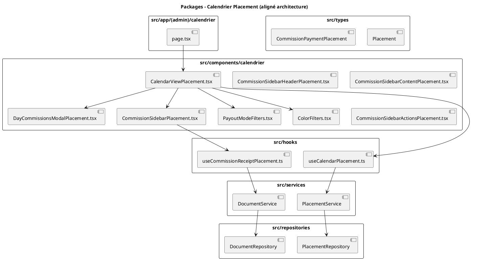
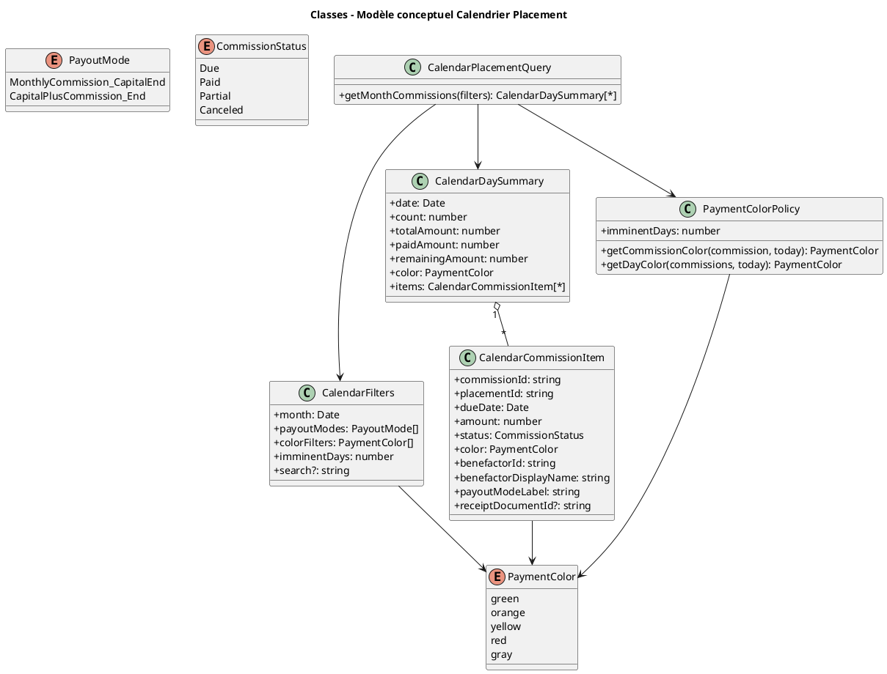
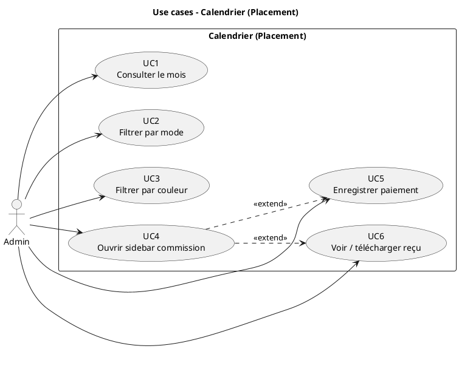
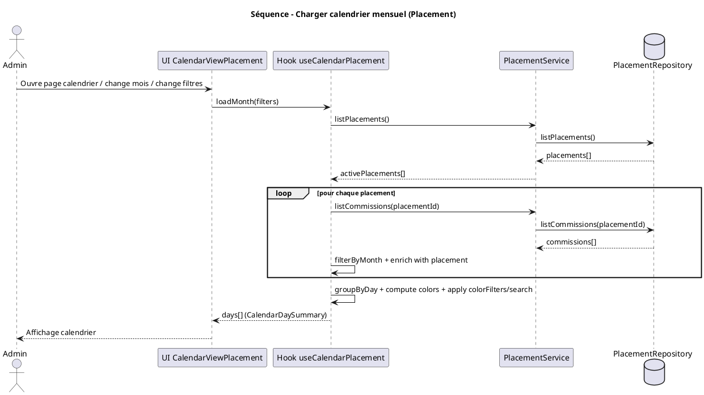
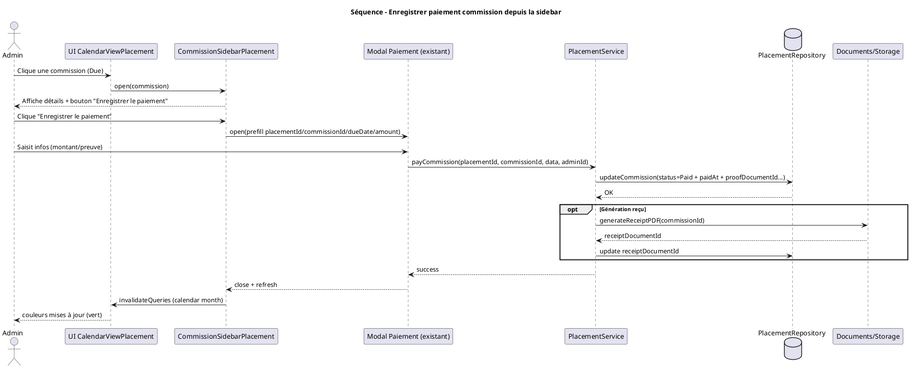
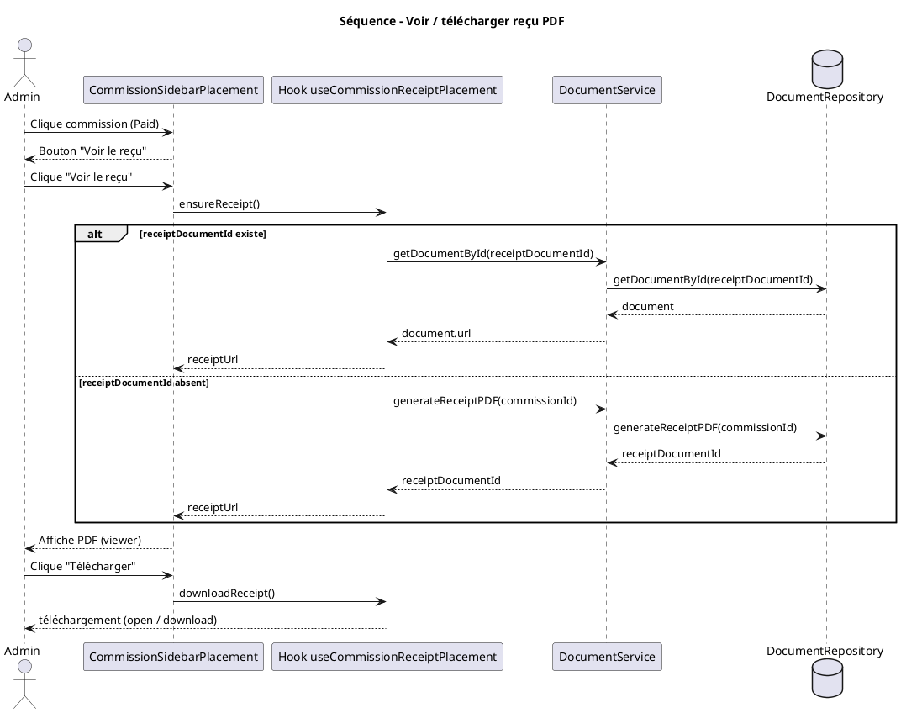
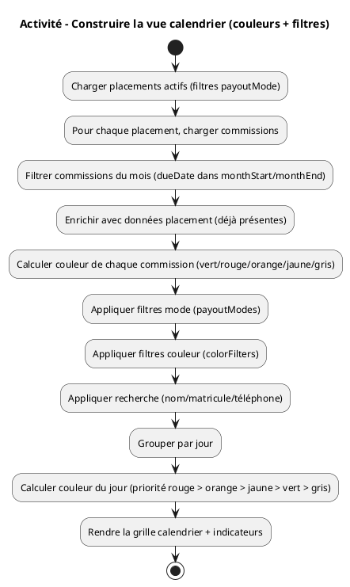

# Analyse – Calendrier des versements – Placement

## 1. Contexte et objectif

### Objectif principal
Créer une vue calendrier mensuelle permettant de visualiser et gérer tous les versements de commissions à effectuer pour les placements, avec la possibilité de filtrer par mode de règlement (commission mensuelle ou capital+commissions à la fin).

### Périmètre
- Module : Placement (Bienfaiteur)
- Types de placements : `MonthlyCommission_CapitalEnd` (commission mensuelle), `CapitalPlusCommission_End` (capital+commissions à la fin)
- Vue : Calendrier mensuel avec filtres par mode de règlement
- Fonctionnalités : Visualisation des commissions, filtrage par mode, enregistrement de paiements depuis le calendrier

---

## 2. Structure des données

### 2.1 Placements (Placement)

Les placements sont caractérisés par leur mode de règlement :

```typescript
interface Placement {
  id: string
  benefactorId: string // User.id avec rôle Bienfaiteur
  benefactorName?: string
  benefactorPhone?: string
  urgentContact?: {
    name: string
    firstName?: string
    phone: string
    phone2?: string
    relationship?: string
    idNumber?: string
    typeId?: string
    documentPhotoUrl?: string
  }
  amount: number // Montant du placement
  rate: number // Taux de commission (en pourcentage)
  periodMonths: number // Durée en mois (1..7)
  payoutMode: 'MonthlyCommission_CapitalEnd' | 'CapitalPlusCommission_End' // Mode de règlement (clé pour le calendrier)
  status: 'Draft' | 'Active' | 'Closed' | 'EarlyExit' | 'Canceled'
  startDate?: Date // Date de début du placement
  endDate?: Date // Date de fin du placement
  nextCommissionDate?: Date // Prochaine date de commission
  hasOverdueCommission?: boolean // Indicateur de commission en retard
  contractDocumentId?: string
  finalQuittanceDocumentId?: string
  earlyExitQuittanceDocumentId?: string
  earlyExitAddendumDocumentId?: string
  closingReason?: string
  createdAt: Date
  updatedAt: Date
  createdBy: string
  updatedBy?: string
}
```

### 2.2 Commissions (CommissionPaymentPlacement)

Les commissions sont stockées dans une sous-collection `commissions` de chaque placement :

```typescript
interface CommissionPaymentPlacement {
  id: string
  placementId: string // ID du placement parent
  dueDate: Date // Date d'échéance (clé pour le calendrier)
  amount: number // Montant de la commission
  status: 'Due' | 'Paid' | 'Partial' | 'Canceled'
  proofDocumentId?: string // Document.id de la preuve de paiement
  receiptDocumentId?: string // Document.id du reçu/quittance
  paidAt?: Date // Date de paiement
  createdAt: Date
  updatedAt: Date
  createdBy: string
  updatedBy?: string
}
```

**Note importante** : Les commissions sont générées automatiquement lors de l'activation du placement selon le `payoutMode` :
- **MonthlyCommission_CapitalEnd** : Une commission mensuelle est créée pour chaque mois (`periodMonths` commissions)
- **CapitalPlusCommission_End** : Une seule commission est créée à la fin avec le total des commissions (`monthlyCommissionAmount * periodMonths`)

### 2.3 Modes de règlement

#### Commission Mensuelle + Capital à la Fin (`MonthlyCommission_CapitalEnd`)
- **Fréquence** : Commissions mensuelles
- **Caractéristiques** : 
  - Une commission pour chaque mois de la période
  - Montant mensuel : `(amount * rate) / 100`
  - Dates d'échéance : `startDate + i mois` pour i = 0 à `periodMonths - 1`
  - Le capital est remboursé à la fin
- **Affichage par défaut** : Oui (par défaut dans le calendrier)

#### Capital + Commissions à la Fin (`CapitalPlusCommission_End`)
- **Fréquence** : Commission unique à la fin
- **Caractéristiques** :
  - Une seule commission à la date de fin (`endDate`)
  - Montant total : `(amount * rate / 100) * periodMonths`
  - Le capital et toutes les commissions sont payés ensemble à la fin
- **Affichage** : Via filtre switch

---

## 3. Analyse fonctionnelle

### 3.1 Affichage du calendrier mensuel

#### Vue calendrier par défaut
- **Mode affiché par défaut** : Placements `MonthlyCommission_CapitalEnd` uniquement
- **Format** : Calendrier mensuel classique (grille 7 jours × ~5 semaines)
- **Navigation** : Mois précédent/suivant, sélection de mois/année
- **Affichage par jour** :
  - Nombre de commissions (badge avec compteur)
  - Montant total des commissions du jour
  - **Indicateur visuel selon le statut et la date** :
    - 🟢 **Vert** : Commissions enregistrées (payées)
      - Condition : `status === 'Paid'`
      - Signification : La commission a été complètement enregistrée
    - 🟠 **Orange** : Commissions imminentes (à l'approche du jour de paiement)
      - Condition : `status === 'Due'` ET `dueDate >= aujourd'hui` ET `dueDate <= aujourd'hui + N jours`
      - Exemple : On est le 13, une commission prévue le 13 / 14 / 15 (si \(N=2\)) sera en orange
      - Signification : Commissions très proches, à traiter en priorité
    - 🟡 **Jaune** : Commissions à venir (non encore imminentes)
      - Condition : `status === 'Due'` ET `dueDate > aujourd'hui + N jours`
      - Exemple : On est le 13, une commission prévue le 20 (si \(N=2\)) sera en jaune
      - Signification : Commissions prévues mais pas encore urgents
    - 🔴 **Rouge** : Commissions en retard (passées et non enregistrées)
      - Condition : `status === 'Due'` ET `dueDate < aujourd'hui` (date d'échéance < date du jour)
      - Exemple : On est le 13, il y avait 2 commissions prévues le 12 qui n'ont pas été enregistrées → elles seront en rouge
      - Signification : Commissions qui auraient dû être payées mais qui ne l'ont pas été
    - ⚪ **Gris** : Commissions annulées ou aucun versement
      - Condition : `status === 'Canceled'` OU aucun versement
      - Signification : Commissions annulées ou jour sans commission

#### Filtres par mode de règlement

**Composant de filtrage** : Switches/Toggles pour chaque mode

```
┌─────────────────────────────────────────┐
│  Filtres par mode de règlement         │
├─────────────────────────────────────────┤
│  ☑ Commission mensuelle (par défaut)  │
│  ☐ Capital + commissions à la fin       │
└─────────────────────────────────────────┘
```

**Comportement** :
- Par défaut : Seul "Commission mensuelle" est activé
- L'utilisateur peut activer/désactiver chaque mode indépendamment
- Les deux modes peuvent être affichés simultanément
- Le calendrier se met à jour automatiquement lors du changement de filtre

#### Filtres par couleur (statut)

**Objectif** : pouvoir afficher/masquer les commissions selon leur état (payé / en retard / imminent / à venir).

**Composant de filtrage** : chips / switches (multi-sélection), par exemple :

- ☑ Payées (🟢)
- ☑ En retard (🔴)
- ☑ Imminentes (🟠) *(\(N\) jours avant échéance, configurable)*
- ☑ À venir (🟡)
- ☐ Annulées (⚪) *(souvent masqué par défaut)*

**Règle de couleur (rappel)** :
- 🟢 `Paid`
- 🔴 `Due` et `dueDate < aujourd'hui`
- 🟠 `Due` et `dueDate ∈ [aujourd'hui ; aujourd'hui + N jours]`
- 🟡 `Due` et `dueDate > aujourd'hui + N jours`
- ⚪ `Canceled`

#### Changement de mois (passé / futur)

Comme c'est un calendrier, l'admin peut naviguer sur les **mois passés** et **mois futurs** :
- **Portée des données** : on charge uniquement les commissions dont `dueDate` est **dans le mois affiché** (filtre `dueDateFrom` / `dueDateTo`).
- **Couleurs** : elles restent calculées **par rapport à la date du jour** (today). Donc :
  - Sur un mois passé : les commissions non payées apparaîtront majoritairement en **rouge**.
  - Sur un mois futur : les commissions non payées apparaîtront en **jaune/orange** selon le seuil \(N\).

#### Données à afficher par jour

Pour chaque jour du mois, afficher :
- Nombre de commissions (`count`)
- Montant total des commissions (`totalAmount`)
- Montant total déjà payé (`paidAmount`)
- Montant restant (`remainingAmount`)
- Liste des commissions avec :
  - Nom du bienfaiteur (`benefactorName`)
  - Mode de règlement (`MonthlyCommission_CapitalEnd`, `CapitalPlusCommission_End`)
  - Montant de la commission (`amount`)
  - Statut (`Due`, `Paid`, `Partial`, `Canceled`)
  - ID du placement

### 3.2 Récupération des données

#### Requête pour un mois donné avec filtres

```typescript
// Exemple : récupérer tous les placements actifs pour janvier 2024
// Filtrer par mode de règlement selon les filtres sélectionnés

interface CalendarFilters {
  month: Date                    // Mois à afficher
  payoutModes: PayoutMode[]      // Modes sélectionnés : ['MonthlyCommission_CapitalEnd'] par défaut
}

// Étape 1 : Récupérer les placements avec les modes sélectionnés
const placements = await placementRepository.listPlacements()
const activePlacements = placements.filter(
  (p: Placement) => p.status === 'Active'
)

// Filtrer par modes de règlement
const filteredPlacements =
  payoutModes.length > 0
    ? activePlacements.filter((p: Placement) => 
        payoutModes.includes(p.payoutMode)
      )
    : activePlacements

// Étape 2 : Pour chaque placement, récupérer les commissions du mois
const monthStart = startOfMonth(filters.month)
const monthEnd = endOfMonth(filters.month)

const commissions: Array<CommissionPaymentPlacement & { placement: Placement }> = []

for (const placement of filteredPlacements) {
  // Récupérer toutes les commissions du placement
  const placementCommissions = await placementRepository.listCommissions(placement.id)
  
  // Filtrer les commissions du mois
  const monthCommissions = placementCommissions.filter((c: CommissionPaymentPlacement) => {
    const dueDateStart = startOfDay(c.dueDate)
    return dueDateStart >= monthStart && dueDateStart <= monthEnd
  })
  
  // Enrichir avec les informations du placement
  commissions.push(...monthCommissions.map((c: CommissionPaymentPlacement) => ({
    ...c,
    placement,
  })))
}

// Étape 3 : Enrichir avec les données du bienfaiteur
// Les données du bienfaiteur sont déjà dans le placement (benefactorName, benefactorPhone)

// Étape 4 : Grouper par jour
const groupedByDay = groupCommissionsByDay(commissions)
```

#### Enrichissement des données

Pour chaque commission, il faut récupérer :
1. Les informations du placement (`Placement`) pour obtenir le mode de règlement et les données du bienfaiteur
2. Les données du bienfaiteur sont déjà présentes dans le placement (`benefactorName`, `benefactorPhone`)

#### Groupement par jour

```typescript
interface DayCommissions {
  date: Date
  commissions: Array<CommissionPaymentPlacement & { placement: Placement }>
  totalAmount: number
  paidAmount: number
  remainingAmount: number
  count: number
  statuses: ('Due' | 'Paid' | 'Partial' | 'Canceled')[]
  payoutModes: PayoutMode[] // Modes de règlement présents ce jour
  color: 'green' | 'orange' | 'yellow' | 'red' | 'gray' // Couleur du jour selon la logique métier
}

// Fonction pour calculer la couleur d'un jour
function calculateDayColor(
  commissions: Array<CommissionPaymentPlacement & { placement: Placement }>,
  today: Date
): 'green' | 'orange' | 'yellow' | 'red' | 'gray' {
  if (commissions.length === 0) return 'gray'
  
  const todayStart = startOfDay(today)
  const IMMINENT_DAYS = 2 // configurable (ex: 0 = seulement aujourd'hui, 2 = J+2, 3 = J+3)
  
  // Vérifier s'il y a des commissions en retard (rouge)
  const hasOverdue = commissions.some(
    (c) => c.status === 'Due' && startOfDay(c.dueDate) < todayStart
  )
  if (hasOverdue) return 'red'

  // Vérifier s'il y a des commissions imminentes (orange)
  const hasImminent = commissions.some((c) => {
    if (c.status !== 'Due') return false
    const dueStart = startOfDay(c.dueDate)
    const diffDays = Math.floor((dueStart.getTime() - todayStart.getTime()) / (1000 * 60 * 60 * 24))
    return diffDays >= 0 && diffDays <= IMMINENT_DAYS
  })
  if (hasImminent) return 'orange'

  // Vérifier s'il y a des commissions à venir (jaune)
  const hasUpcoming = commissions.some((c) => {
    if (c.status !== 'Due') return false
    const dueStart = startOfDay(c.dueDate)
    const diffDays = Math.floor((dueStart.getTime() - todayStart.getTime()) / (1000 * 60 * 60 * 24))
    return diffDays > IMMINENT_DAYS
  })
  if (hasUpcoming) return 'yellow'
  
  // Vérifier si toutes les commissions sont payées (vert)
  const allPaid = commissions.every((c) => c.status === 'Paid')
  if (allPaid) return 'green'
  
  // Vérifier si toutes les commissions sont annulées (gris)
  const allCanceled = commissions.every((c) => c.status === 'Canceled')
  if (allCanceled) return 'gray'
  
  // Par défaut : jaune
  return 'yellow'
}

// Grouper les commissions par jour
const today = new Date()
const groupedByDay = commissions.reduce(
  (acc: Record<string, DayCommissions>, commission: CommissionPaymentPlacement & { placement: Placement }) => {
    const dayKey = format(commission.dueDate, 'yyyy-MM-dd')
    if (!acc[dayKey]) {
      acc[dayKey] = {
        date: commission.dueDate,
        commissions: [],
        totalAmount: 0,
        paidAmount: 0,
        remainingAmount: 0,
        count: 0,
        statuses: [],
        payoutModes: [],
        color: 'gray', // Sera calculé après le groupement
      }
    }
    
    acc[dayKey].commissions.push(commission)
    acc[dayKey].totalAmount += commission.amount
    if (commission.status === 'Paid') {
      acc[dayKey].paidAmount += commission.amount
    } else if (commission.status === 'Due') {
      acc[dayKey].remainingAmount += commission.amount
    }
    acc[dayKey].count++
    acc[dayKey].statuses.push(commission.status)
    
    if (!acc[dayKey].payoutModes.includes(commission.placement.payoutMode)) {
      acc[dayKey].payoutModes.push(commission.placement.payoutMode)
    }
    
    return acc
  },
  {} as Record<string, DayCommissions>
)

// Calculer la couleur pour chaque jour
Object.values(groupedByDay).forEach((day) => {
  day.color = calculateDayColor(day.commissions, today)
})
```

### 3.3 Interaction avec le calendrier

#### Clic sur un jour
Lorsqu'on clique sur un jour du calendrier :
1. Ouvrir un modal ou un panneau latéral avec la liste des commissions du jour
2. Afficher la liste détaillée des commissions de ce jour
3. Grouper par mode de règlement (Commission mensuelle, Capital+commissions à la fin)
4. Pour chaque commission dans la liste, afficher :
   - Nom du bienfaiteur (`benefactorName`)
   - Mode de règlement avec badge coloré
   - Montant de la commission (`amount`)
   - **Badge de couleur** selon le statut (vert/orange/jaune/rouge/gris)
   - ID du placement
   - Date d'échéance (`dueDate`)

#### Clic sur une commission individuelle
Lorsqu'on clique sur une commission individuelle (depuis la liste du jour ou directement depuis le calendrier) :
1. **Ouvrir une sidebar à droite** qui s'affiche avec animation
2. **Structure de la sidebar** en 3 zones :

##### Zone 1 : En-tête fixe (top-0, position fixed)
**Informations du bienfaiteur et du placement**
- Photo du bienfaiteur (si disponible, depuis le User)
- Nom complet du bienfaiteur (`benefactorName`)
- Contacts du bienfaiteur (`benefactorPhone`)
- **Informations du placement** :
  - Mode de règlement avec badge (Commission mensuelle / Capital+commissions à la fin)
  - ID du placement
  - Statut du placement (`Active`, `Closed`, `EarlyExit`, `Canceled`)
  - Montant du placement (`amount`)
  - Taux de commission (`rate`)
  - Durée (`periodMonths`)
  - Date de début (`startDate`)
  - Date de fin (`endDate`)

##### Zone 2 : Contenu scrollable (middle)
**Détails sur la commission et le placement**
- **Informations de la commission** :
  - Date d'échéance (`dueDate`)
  - Montant de la commission (`amount`)
  - Statut avec badge coloré (`Due`, `Paid`, `Partial`, `Canceled`)
  - Date de paiement (`paidAt`) si payée
  - Preuve de paiement (`proofDocumentId`) si payée
- **Historique des commissions** (liste scrollable) :
  - Commissions précédentes du placement
  - Commissions suivantes prévues
  - Statistiques du placement (montant total payé, nombre de commissions payées)

##### Zone 3 : Actions fixes (bottom-0, position fixed/absolute)
**Bouton d'action principal**
- **Si commission non payée** (`status === 'Due'` OU `status === 'Partial'`) :
  - Bouton "Enregistrer le paiement" (couleur primaire)
  - Au clic : Ouvrir le formulaire d'enregistrement de paiement
- **Si commission payée** (`status === 'Paid'`) :
  - Bouton "Voir le reçu" (couleur secondaire)
  - Au clic : Afficher le reçu PDF dans la zone scrollable
  - Bouton "Télécharger le reçu PDF" (icône de téléchargement)
  - Utiliser la fonctionnalité existante de génération/téléchargement de reçu

#### Enregistrement d'un paiement depuis la sidebar
1. Clic sur "Enregistrer le paiement" dans la sidebar
2. Ouvrir le modal de paiement existant
3. Pré-remplir :
   - `placementId` : ID du placement
   - `commissionId` : ID de la commission
   - Date suggérée : date d'échéance de la commission ou date du jour
   - Montant suggéré : montant de la commission
4. L'admin saisit les informations du paiement (montant, preuve, etc.)
5. Après enregistrement :
   - Fermer le modal
   - Rafraîchir la sidebar (mettre à jour les informations)
   - Rafraîchir le calendrier
   - Mettre à jour les indicateurs visuels
   - Afficher une notification de succès
   - Le bouton passe de "Enregistrer le paiement" à "Voir le reçu"

#### Affichage du reçu PDF dans la sidebar
1. Clic sur "Voir le reçu" pour une commission payée
2. **Afficher le reçu dans la zone scrollable** :
   - Intégrer un viewer PDF (iframe ou composant PDF viewer)
   - Afficher le reçu depuis `receiptDocumentId` du paiement
   - Si le reçu n'existe pas encore, le générer automatiquement
3. **Bouton de téléchargement** :
   - Toujours visible dans la zone d'actions (bottom)
   - Permet de télécharger le reçu en PDF
   - Utiliser la fonctionnalité existante de téléchargement

---

## 4. Structure technique

### 4.1 Composants à créer

#### `CalendarViewPlacement.tsx`
Composant principal du calendrier avec :
- Navigation mois/année
- Grille calendrier
- Filtres par mode de règlement (switches)
- Gestion des clics sur les jours
- Intégration avec les hooks de données

#### `PayoutModeFilters.tsx`
Composant pour les filtres par mode :
- Switches pour chaque mode (`MonthlyCommission_CapitalEnd`, `CapitalPlusCommission_End`)
- État par défaut : `MonthlyCommission_CapitalEnd` activé
- Gestion de l'état des filtres
- Callback pour notifier les changements

#### `CalendarDayPlacement.tsx`
Composant pour afficher un jour du calendrier :
- Badge avec compteur de commissions
- **Indicateur visuel de couleur** :
  - Fond ou bordure colorée selon `dayCommissions.color`
  - 🟢 Vert : Toutes les commissions payées
  - 🟠 Orange : Commissions imminentes (date proche, \(N\) jours)
  - 🟡 Jaune : Commissions à venir (date future)
  - 🔴 Rouge : Commissions en retard (date < aujourd'hui)
  - ⚪ Gris : Commissions annulées ou aucune commission
- Montant total affiché
- Badge indiquant les modes de règlement présents
- Gestion du clic avec feedback visuel

#### `DayCommissionsModalPlacement.tsx`
Modal affichant les commissions d'un jour :
- Liste des commissions groupées par mode de règlement
- Informations détaillées par commission
- **Badge de couleur pour chaque commission** selon la logique :
  - Fonction utilitaire `getCommissionColor(commission: CommissionPaymentPlacement, today: Date)` :
    ```typescript
    function getCommissionColor(
      commission: CommissionPaymentPlacement, 
      today: Date
    ): 'green' | 'orange' | 'yellow' | 'red' | 'gray' {
      const IMMINENT_DAYS = 2 // configurable
      if (commission.status === 'Paid') return 'green'
      if (commission.status === 'Canceled') return 'gray'
      if (commission.status === 'Due') {
        const todayStart = startOfDay(today)
        const dueDateStart = startOfDay(commission.dueDate)
        if (dueDateStart < todayStart) return 'red'
        const diffDays = Math.floor((dueDateStart.getTime() - todayStart.getTime()) / (1000 * 60 * 60 * 24))
        return diffDays <= IMMINENT_DAYS ? 'orange' : 'yellow'
      }
      return 'gray'
    }
    ```
- Clic sur une commission → ouvre `CommissionSidebarPlacement`

#### `CommissionSidebarPlacement.tsx`
Sidebar à droite affichant les détails d'une commission :

**Structure en 3 zones** :

1. **Zone en-tête (top-0, position fixed)**
   - Composant `CommissionSidebarHeaderPlacement.tsx`
   - Informations du bienfaiteur :
     - Photo du bienfaiteur (depuis User)
     - Nom complet (`benefactorName`)
     - Contacts (`benefactorPhone`)
   - Informations du placement :
     - Mode de règlement avec badge
     - ID du placement
     - Statut du placement
     - Montant du placement
     - Taux de commission
     - Durée (période en mois)
     - Dates de début et de fin

2. **Zone contenu (middle, scrollable)**
   - Composant `CommissionSidebarContentPlacement.tsx`
   - Détails de la commission :
     - Date d'échéance
     - Montant de la commission
     - Statut avec badge coloré
     - Date de paiement (si payée)
   - Historique des commissions :
     - Liste des commissions précédentes
     - Commissions suivantes prévues
   - Statistiques du placement :
     - Montant total payé
     - Nombre de commissions payées
   - **Affichage du reçu PDF** (si commission payée et "Voir le reçu" cliqué) :
     - Viewer PDF intégré (iframe ou composant PDF)
     - Affichage depuis `receiptDocumentId` de la commission
     - Génération automatique si le reçu n'existe pas

3. **Zone actions (bottom-0, position fixed/absolute)**
   - Composant `CommissionSidebarActionsPlacement.tsx`
   - **Bouton conditionnel** :
     - Si `status === 'Due'` OU `status === 'Partial'` : Bouton "Enregistrer le paiement"
       - Ouvre le modal de paiement existant
     - Si `status === 'Paid'` : Bouton "Voir le reçu"
       - Affiche le reçu PDF dans la zone scrollable
       - Bouton "Télécharger le reçu PDF" (icône de téléchargement)
       - Utilise la fonctionnalité existante de téléchargement

**Fonctionnalités** :
- Animation d'ouverture/fermeture (slide depuis la droite)
- Overlay pour fermer la sidebar (clic en dehors)
- Bouton de fermeture (X) en haut à droite
- Responsive : s'adapte sur mobile (plein écran ou drawer)

### 4.2 Hooks à créer

#### `useCalendarPlacement(month: Date, payoutModes: PayoutMode[])`
Hook pour récupérer les commissions d'un mois avec filtres :

```typescript
function useCalendarPlacement(
  month: Date, 
  payoutModes: PayoutMode[]
) {
  const filters = useMemo(() => ({
    monthStart: startOfMonth(month),
    monthEnd: endOfMonth(month),
    payoutModes
  }), [month, payoutModes])
  
  return useQuery({
    queryKey: ['calendar-placements', format(month, 'yyyy-MM'), payoutModes.join(',')],
    queryFn: async () => {
      // 1. Récupérer tous les placements actifs
      const service = ServiceFactory.getPlacementService()
      const allPlacements = await service.listPlacements()
      const activePlacements = allPlacements.filter(
        (p: Placement) => p.status === 'Active'
      )
      
      // Filtrer par modes de règlement
      const filteredPlacements =
        payoutModes.length > 0
          ? activePlacements.filter((p: Placement) => 
              payoutModes.includes(p.payoutMode)
            )
          : activePlacements
      
      // 2. Récupérer les commissions pour chaque placement
      const commissions: Array<CommissionPaymentPlacement & { placement: Placement }> = []
      
      for (const placement of filteredPlacements) {
        try {
          const placementCommissions = await service.listCommissions(placement.id)
          
          // Filtrer les commissions du mois
          const monthCommissions = placementCommissions.filter((c: CommissionPaymentPlacement) => {
            const dueDateStart = startOfDay(c.dueDate)
            return dueDateStart >= filters.monthStart && dueDateStart <= filters.monthEnd
          })
          
          // Enrichir avec les informations du placement
          commissions.push(...monthCommissions.map((c: CommissionPaymentPlacement) => ({
            ...c,
            placement,
          })))
        } catch (error) {
          console.error(
            `Erreur lors de la récupération des commissions pour le placement ${placement.id}:`,
            error
          )
        }
      }
      
      // 3. Enrichir avec les données du bienfaiteur (déjà dans le placement)
      // 4. Grouper par jour
      return groupCommissionsByDay(commissions)
    },
    staleTime: 5 * 60 * 1000, // 5 minutes
  })
}
```

#### `useGroupedCommissionsByDayPlacement(commissions: CommissionPaymentPlacement[])`
Hook pour grouper les commissions par jour :

```typescript
function useGroupedCommissionsByDayPlacement(
  commissions: Array<CommissionPaymentPlacement & { placement: Placement }>
) {
  return useMemo(() => {
    // Logique de groupement par jour
    // Enrichissement avec les données du bienfaiteur (déjà dans le placement)
    return groupedCommissions
  }, [commissions])
}
```

### 4.3 Services existants à réutiliser

- `PlacementService.payCommission()` : Pour enregistrer un paiement de commission
- `PlacementRepository.listPlacements()` : Pour récupérer les placements
- `PlacementRepository.listCommissions()` : Pour récupérer les commissions
- **Services de génération/téléchargement de reçu PDF** :
  - Fonctionnalité existante dans les modules pour générer les reçus PDF
  - Fonctionnalité existante pour télécharger les reçus PDF
  - Réutiliser `receiptDocumentId` de la commission pour afficher le reçu
  - Si `receiptDocumentId` n'existe pas, utiliser le service de génération de reçu existant

### 4.4 Structure de la sidebar

#### Layout de la sidebar

```typescript
<div className="fixed inset-y-0 right-0 w-full md:w-96 bg-white shadow-xl z-50 flex flex-col">
  {/* Zone 1 : En-tête fixe (top-0) */}
  <div className="fixed top-0 right-0 w-full md:w-96 bg-white border-b z-10">
    <CommissionSidebarHeaderPlacement 
      placement={placement}
      onClose={() => setSelectedCommission(null)}
    />
  </div>
  
  {/* Zone 2 : Contenu scrollable (middle) */}
  <div className="flex-1 overflow-y-auto pt-[header-height] pb-[actions-height]">
    <CommissionSidebarContentPlacement 
      commission={commission}
      placement={placement}
      commissionHistory={commissionHistory}
      showReceipt={showReceipt}
    />
  </div>
  
  {/* Zone 3 : Actions fixes (bottom-0) */}
  <div className="fixed bottom-0 right-0 w-full md:w-96 bg-white border-t z-10">
    <CommissionSidebarActionsPlacement 
      commission={commission}
      onRecordPayment={() => openPaymentModal()}
      onViewReceipt={() => setShowReceipt(true)}
      onDownloadReceipt={() => downloadReceipt()}
    />
  </div>
</div>
```

#### Gestion du reçu PDF

```typescript
// Hook pour gérer l'affichage et le téléchargement du reçu
function useCommissionReceiptPlacement(commission: CommissionPaymentPlacement) {
  const [receiptUrl, setReceiptUrl] = useState<string | null>(null)
  const [isGenerating, setIsGenerating] = useState(false)
  
  const generateReceipt = async () => {
    if (receiptUrl) return receiptUrl
    
    setIsGenerating(true)
    try {
      // Utiliser le service existant de génération de reçu
      // Récupérer le document depuis receiptDocumentId
      const documentService = ServiceFactory.getDocumentService()
      if (commission.receiptDocumentId) {
        const document = await documentService.getDocumentById(commission.receiptDocumentId)
        if (document) {
          setReceiptUrl(document.url)
          return document.url
        }
      }
      throw new Error("Reçu non disponible")
    } catch (error) {
      console.error('Erreur lors de la génération du reçu:', error)
      throw error
    } finally {
      setIsGenerating(false)
    }
  }
  
  const downloadReceipt = async () => {
    const url = receiptUrl || await generateReceipt()
    // Utiliser la fonctionnalité existante de téléchargement
    window.open(url, '_blank')
  }
  
  return {
    receiptUrl,
    isGenerating,
    generateReceipt,
    downloadReceipt
  }
}
```

---

## 5. Logique métier

### 5.1 Calcul du statut d'un jour

Un jour peut avoir plusieurs commissions avec différents statuts. Le statut visuel du jour est déterminé par la **priorité suivante** :

#### Logique de détermination de la couleur

```typescript
function getDayColor(
  commissions: Array<CommissionPaymentPlacement & { placement: Placement }>, 
  today: Date
): 'green' | 'orange' | 'yellow' | 'red' | 'gray' {
  const todayStart = startOfDay(today)
  const IMMINENT_DAYS = 2 // configurable
  
  // Vérifier s'il y a des commissions en retard (rouge)
  const hasOverdue = commissions.some(
    (c) => c.status === 'Due' && startOfDay(c.dueDate) < todayStart
  )
  if (hasOverdue) return 'red'
  
  // Vérifier s'il y a des commissions imminentes (orange)
  const hasImminent = commissions.some((c) => {
    if (c.status !== 'Due') return false
    const dueStart = startOfDay(c.dueDate)
    const diffDays = Math.floor((dueStart.getTime() - todayStart.getTime()) / (1000 * 60 * 60 * 24))
    return diffDays >= 0 && diffDays <= IMMINENT_DAYS
  })
  if (hasImminent) return 'orange'

  // Vérifier s'il y a des commissions à venir (jaune)
  const hasUpcoming = commissions.some((c) => {
    if (c.status !== 'Due') return false
    const dueStart = startOfDay(c.dueDate)
    const diffDays = Math.floor((dueStart.getTime() - todayStart.getTime()) / (1000 * 60 * 60 * 24))
    return diffDays > IMMINENT_DAYS
  })
  if (hasUpcoming) return 'yellow'
  
  // Vérifier si toutes les commissions sont payées (vert)
  const allPaid = commissions.length > 0 && commissions.every((c) => c.status === 'Paid')
  if (allPaid) return 'green'
  
  // Vérifier si toutes les commissions sont annulées (gris)
  const allCanceled = commissions.length > 0 && commissions.every((c) => c.status === 'Canceled')
  if (allCanceled) return 'gray'
  
  // Par défaut : jaune si des commissions existent
  return commissions.length > 0 ? 'yellow' : 'gray'
}
```

#### Priorité des couleurs

1. **🔴 Rouge (Priorité 1)** : En retard
   - Condition : Au moins une commission avec `status === 'Due'` ET `dueDate < aujourd'hui`
   - Exemple : On est le 13 janvier, il y a 2 commissions prévues le 12 janvier qui n'ont pas été enregistrées → le jour du 12 sera en rouge
   - Signification : Action requise immédiatement

2. **🟠 Orange (Priorité 2)** : Imminent (à l'approche)
   - Condition : Au moins une commission `Due` avec `dueDate ∈ [aujourd'hui ; aujourd'hui + N jours]`
   - Signification : À traiter en priorité dans les prochains jours

3. **🟡 Jaune (Priorité 3)** : À venir
   - Condition : Au moins une commission `Due` avec `dueDate > aujourd'hui + N jours`
   - Signification : Commissions prévues mais pas encore urgents

4. **🟢 Vert (Priorité 4)** : Payé
   - Condition : Toutes les commissions ont `status === 'Paid'`
   - Signification : Toutes les commissions du jour ont été enregistrées

5. **⚪ Gris (Par défaut)** : Annulé ou aucune commission
   - Condition : Toutes les commissions ont `status === 'Canceled'` OU aucune commission
   - Signification : Commissions annulées ou jour sans commission

#### Exemples concrets

**Exemple 1 : Jour avec commissions mixtes**
- Date : 12 janvier
- Aujourd'hui : 13 janvier
- Commissions :
  - Commission 1 : `dueDate = 12 janvier`, `status = 'Due'` → En retard
  - Commission 2 : `dueDate = 12 janvier`, `status = 'Paid'` → Payée
- **Résultat** : 🔴 Rouge (priorité à la commission en retard)

**Exemple 2 : Jour avec commissions à venir**
- Date : 15 janvier
- Aujourd'hui : 13 janvier
- Commissions :
  - Commission 1 : `dueDate = 15 janvier`, `status = 'Due'` → À venir
- **Résultat** : 🟠 Orange si \(N \ge 2\), sinon 🟡 Jaune

**Exemple 3 : Jour avec toutes les commissions payées**
- Date : 10 janvier
- Aujourd'hui : 13 janvier
- Commissions :
  - Commission 1 : `dueDate = 10 janvier`, `status = 'Paid'` → Payée
  - Commission 2 : `dueDate = 10 janvier`, `status = 'Paid'` → Payée
- **Résultat** : 🟢 Vert (toutes payées)

### 5.2 Filtrage par mode de règlement

#### Comportement des filtres
- **Par défaut** : Seul `MonthlyCommission_CapitalEnd` est activé
- **Sélection multiple** : L'utilisateur peut activer plusieurs modes simultanément
- **Désélection** : Si tous les filtres sont désactivés, afficher un message "Aucun filtre sélectionné"
- **Mise à jour** : Le calendrier se met à jour automatiquement lors du changement de filtre

#### Filtres par statut (optionnel)
En plus des filtres par mode, on peut ajouter :
- Toutes les commissions
- Commissions à venir uniquement (exclure `Paid`)
- Commissions en retard uniquement (`Due` avec `dueDate < aujourd'hui`)

### 5.3 Gestion des commissions partielles

Si une commission a un statut `Partial` :
- Afficher le montant payé et le montant restant
- Permettre d'enregistrer un nouveau paiement pour compléter la commission
- Le statut passera à `Paid` lorsque le montant payé atteint le montant dû

### 5.4 Différences entre modes de règlement

#### Commission Mensuelle (`MonthlyCommission_CapitalEnd`)
- Commissions mensuelles
- Peuvent avoir plusieurs commissions dans un même placement
- Affichage par défaut dans le calendrier
- Badge spécial pour identifier ce mode

#### Capital + Commissions à la Fin (`CapitalPlusCommission_End`)
- Commission unique à la fin
- Structure plus simple
- Affichage via filtre switch
- Badge spécial pour identifier ce mode

---

## 6. Cas d'usage

### UC1 – Visualiser le calendrier mensuel (par défaut)

**Acteur** : Admin

**Scénario principal** :
1. L'admin accède à la page Calendrier > Placement
2. Le calendrier affiche le mois en cours
3. Par défaut, seules les commissions des placements `MonthlyCommission_CapitalEnd` sont affichées
4. Les jours avec des commissions sont marqués visuellement
5. L'admin peut naviguer vers les mois précédents/suivants

**Postconditions** :
- Le calendrier affiche uniquement les commissions des placements avec commission mensuelle
- Les indicateurs visuels reflètent correctement les statuts

---

### UC2 – Filtrer par mode de règlement

**Acteur** : Admin

**Scénario principal** :
1. L'admin voit les filtres par mode de règlement (Commission mensuelle activé par défaut)
2. L'admin active le filtre "Capital + commissions à la fin"
3. Le calendrier se met à jour pour afficher les commissions des placements `MonthlyCommission_CapitalEnd` et `CapitalPlusCommission_End`
4. L'admin peut désactiver le filtre "Commission mensuelle" pour voir uniquement les commissions à la fin

**Scénarios alternatifs** :
- Si l'admin désactive tous les filtres, afficher "Aucun filtre sélectionné"
- Les filtres peuvent être activés/désactivés indépendamment

**Postconditions** :
- Le calendrier affiche uniquement les commissions des modes sélectionnés
- Les indicateurs visuels sont mis à jour

---

### UC3 – Consulter les commissions d'un jour

**Acteur** : Admin

**Scénario principal** :
1. L'admin clique sur un jour du calendrier
2. Un modal s'ouvre avec la liste des commissions de ce jour
3. Les commissions sont groupées par mode de règlement (Commission mensuelle, Capital+commissions à la fin)
4. Pour chaque commission, l'admin voit :
   - Nom du bienfaiteur
   - Mode de règlement avec badge
   - Montant de la commission
   - Statut
   - ID du placement
5. L'admin peut fermer le modal

**Postconditions** :
- Les commissions du jour sont affichées correctement
- Les informations sont à jour

---

### UC4 – Consulter les détails d'une commission (Sidebar)

**Acteur** : Admin

**Scénario principal** :
1. L'admin clique sur une commission (depuis la liste du jour ou directement depuis le calendrier)
2. Une sidebar s'ouvre à droite avec animation
3. **Zone en-tête (fixe en haut)** :
   - L'admin voit les informations du bienfaiteur (photo, nom, contacts)
   - L'admin voit les informations du placement (mode, ID, statut, montant, taux, durée, dates)
4. **Zone contenu (scrollable au milieu)** :
   - L'admin voit les détails de la commission (date, montant, statut, etc.)
   - L'admin voit l'historique des commissions du placement
   - L'admin voit les statistiques du placement
5. **Zone actions (fixe en bas)** :
   - Si la commission n'est pas payée : bouton "Enregistrer le paiement"
   - Si la commission est payée : bouton "Voir le reçu"
6. L'admin peut fermer la sidebar (bouton X ou clic sur l'overlay)

**Postconditions** :
- La sidebar affiche toutes les informations nécessaires
- Les informations sont à jour
- La sidebar peut être fermée facilement

---

### UC5 – Enregistrer un paiement depuis la sidebar

**Acteur** : Admin

**Scénario principal** :
1. L'admin ouvre la sidebar d'une commission non payée
2. L'admin clique sur "Enregistrer le paiement" dans la zone d'actions (en bas)
3. Le modal de paiement s'ouvre avec les informations pré-remplies :
   - `placementId` : ID du placement
   - `commissionId` : ID de la commission
   - Date suggérée : date d'échéance de la commission ou date du jour
   - Montant suggéré : montant de la commission
4. L'admin saisit les informations du paiement (montant, preuve, etc.)
5. L'admin valide le paiement
6. Le système enregistre le paiement
7. La sidebar se met à jour automatiquement :
   - Le bouton passe de "Enregistrer le paiement" à "Voir le reçu"
   - Les informations de la commission sont mises à jour
   - Le statut passe à `Paid`
8. Le calendrier se met à jour automatiquement (couleur passe en vert)

**Scénarios alternatifs** :
- Si le montant saisi est inférieur au montant dû, le statut passe à `Partial`
- Si le paiement complète la commission, le statut passe à `Paid`

**Postconditions** :
- Le paiement est enregistré
- La commission est mise à jour
- La sidebar reflète les changements
- Le calendrier reflète les changements

---

### UC6 – Consulter le reçu d'une commission payée

**Acteur** : Admin

**Scénario principal** :
1. L'admin ouvre la sidebar d'une commission payée (statut `Paid`, couleur verte)
2. L'admin voit le bouton "Voir le reçu" dans la zone d'actions (en bas)
3. L'admin clique sur "Voir le reçu"
4. Le reçu PDF s'affiche dans la zone scrollable de la sidebar :
   - Si le reçu existe déjà (`receiptDocumentId`), il est affiché directement
   - Si le reçu n'existe pas, il est généré automatiquement
5. L'admin peut faire défiler pour voir tout le reçu
6. L'admin peut cliquer sur "Télécharger le reçu PDF" pour télécharger le fichier
7. Le reçu est téléchargé sur l'ordinateur de l'admin

**Scénarios alternatifs** :
- Si la génération du reçu échoue, afficher un message d'erreur
- Si le reçu est en cours de génération, afficher un indicateur de chargement

**Postconditions** :
- Le reçu est affiché dans la sidebar
- Le reçu peut être téléchargé
- La fonctionnalité existante de génération/téléchargement est réutilisée

---

## 7. Points d'attention

### 7.1 Performance
- **Pagination** : Pour les mois avec beaucoup de commissions, envisager une pagination ou un chargement progressif
- **Cache** : Utiliser React Query pour mettre en cache les données du calendrier
- **Optimisation des requêtes** : 
  - Éviter de récupérer toutes les données des placements si on peut les enrichir côté serveur
  - Utiliser des requêtes batch pour récupérer les commissions de plusieurs placements
  - Les données du bienfaiteur sont déjà dans le placement, pas besoin de requête supplémentaire

### 7.2 Données manquantes
- Gérer les cas où un placement n'existe plus (soft delete)
- Gérer les cas où un bienfaiteur n'existe plus
- Afficher des valeurs par défaut si les données sont incomplètes
- Gérer les cas où `startDate` est invalide ou manquant

### 7.3 Synchronisation
- Rafraîchir le calendrier après chaque paiement
- Utiliser les invalidations de React Query pour mettre à jour automatiquement
- Gérer les conflits si plusieurs admins modifient simultanément

### 7.4 Accessibilité
- Rendre le calendrier navigable au clavier
- Ajouter des labels ARIA pour les lecteurs d'écran
- Assurer un contraste suffisant pour les indicateurs visuels
- Rendre les switches accessibles
- Rendre la sidebar accessible au clavier (fermeture avec Escape, navigation au clavier)

### 7.5 UX spécifique aux filtres
- Indiquer clairement quel filtre est actif par défaut
- Permettre de réinitialiser les filtres à l'état par défaut
- Sauvegarder les préférences de filtres de l'utilisateur (localStorage)

### 7.6 UX spécifique à la sidebar
- **Animation** : Transition fluide à l'ouverture/fermeture (slide depuis la droite)
- **Overlay** : Fond semi-transparent pour mettre en évidence la sidebar
- **Responsive** : Sur mobile, la sidebar peut prendre tout l'écran ou être un drawer
- **Hauteurs fixes** : S'assurer que les zones fixes (header et actions) ont des hauteurs définies pour éviter les chevauchements
- **Scroll** : La zone scrollable doit avoir un padding-top et padding-bottom pour éviter que le contenu soit masqué par les zones fixes
- **Génération de reçu** : Afficher un indicateur de chargement pendant la génération du reçu
- **Erreurs** : Gérer les cas où le reçu ne peut pas être généré ou téléchargé
- **Performance** : Lazy loading des données du bienfaiteur et de l'historique si volumineux

### 7.7 Fonctionnalités recommandées (pour un calendrier "optimal")

- **Recherche rapide** : champ de recherche (nom/matricule/téléphone) qui filtre les commissions affichées.
- **Vue "liste" en parallèle** : toggle Calendrier ↔ Liste (triable par retard, montant, bienfaiteur, mode).
- **Compteurs/KPI du mois** : total à encaisser, déjà encaissé, reste à encaisser, nombre de retards.
- **Actions rapides** : bouton "Encaisser" directement depuis un item (sans repasser par la fiche placement).
- **Sélection multiple & actions bulk** : marquer plusieurs commissions, exporter, relancer.
- **Export** : PDF/Excel des commissions du mois (avec filtres appliqués).
- **Rappels/notifications** : relance auto (J-1/J0/J+1) selon couleur (orange/rouge).
- **Historique d'activité** : qui a encaissé quoi et quand (audit simple).
- **Sauvegarde des filtres** : conserver mode/couleur/recherche par utilisateur (localStorage).

---

## 8. Prochaines étapes

1. **Implémentation du composant calendrier de base**
   - Créer `CalendarViewPlacement.tsx` avec navigation mois/année
   - Créer `CalendarDayPlacement.tsx` pour l'affichage des jours
   - Intégrer avec les hooks de données

2. **Implémentation des filtres par mode**
   - Créer `PayoutModeFilters.tsx` avec switches
   - Gérer l'état par défaut (`MonthlyCommission_CapitalEnd` activé)
   - Intégrer avec le hook de données

3. **Enrichissement des données**
   - Créer le hook `useCalendarPlacement`
   - Enrichir les commissions avec les données des placements (déjà présentes)
   - Grouper les commissions par jour

4. **Modal de consultation des commissions d'un jour**
   - Créer `DayCommissionsModalPlacement.tsx`
   - Afficher la liste des commissions groupées par mode
   - Permettre de cliquer sur une commission pour ouvrir la sidebar

5. **Implémentation de la sidebar**
   - Créer `CommissionSidebarPlacement.tsx` avec structure en 3 zones
   - Créer `CommissionSidebarHeaderPlacement.tsx` (zone fixe en haut)
   - Créer `CommissionSidebarContentPlacement.tsx` (zone scrollable au milieu)
   - Créer `CommissionSidebarActionsPlacement.tsx` (zone fixe en bas)
   - Intégrer l'affichage du reçu PDF
   - Intégrer le téléchargement du reçu PDF
   - Intégrer avec le modal de paiement existant

6. **Gestion du reçu PDF**
   - Créer le hook `useCommissionReceiptPlacement`
   - Intégrer avec les services existants de génération de reçu
   - Intégrer avec les services existants de téléchargement de reçu
   - Gérer les états de chargement et d'erreur

7. **Tests et optimisations**
   - Tester avec différents scénarios (beaucoup de commissions, différents modes, etc.)
   - Tester la sidebar sur différents écrans (desktop, tablette, mobile)
   - Optimiser les performances
   - Améliorer l'UX

---

## 9. Analyse UML (proposition)

> Objectif : proposer une **mise en place du calendrier** (Placement) en respectant l'architecture du projet (Pages/Components/Hooks/Services/Repositories/Types), et en réutilisant les logiques existantes (enregistrement paiement, reçu PDF, etc.).

### 9.1 Diagramme de packages (architecture cible)



### 9.2 Diagramme de classes (conceptuel)



### 9.3 Diagramme de cas d'utilisation (Admin)



### 9.4 Diagramme de séquence – Charger un mois (avec filtres)



### 9.5 Diagramme de séquence – Enregistrer un paiement (depuis sidebar)



### 9.6 Diagramme de séquence – Voir / télécharger un reçu (depuis sidebar)



### 9.7 Diagramme d'activité – Couleurs + filtres (mode/couleur/recherche)



---

## 10. Références

- Types : `src/types/types.ts` (Placement, CommissionPaymentPlacement)
- Repository : `src/repositories/placement/` (PlacementRepository)
- Service : `src/services/placement/` (PlacementService)
- Documentation placement : `documentation/placement/` (à vérifier)
- Architecture globale : `documentation/architecture/ARCHITECTURE.md`
- Documentation calendrier caisse spéciale : `documentation/calendrier/ANALYSE_CALENDRIER_CAISSE_SPECIALE.md` (référence pour la structure)
- Documentation calendrier caisse imprévue : `documentation/calendrier/ANALYSE_CALENDRIER_CAISSE_IMPREVUE.md` (référence pour la structure)
