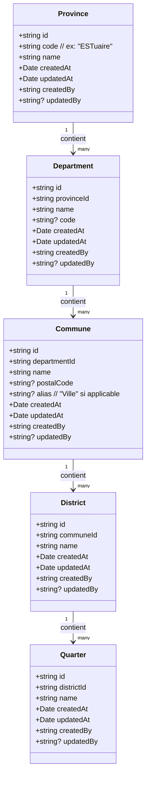

## Module « Géographie » – Provinces, Départements, Communes, Arrondissements, Quartiers

### 1. Objectif et périmètre
- CRUD complet pour cinq entités liées : Province → Département → Commune (ou Ville) → Arrondissement → Quartier.
- Chaque entité est administrable dans l'espace `@(admin)` avec pagination, recherche, filtres par parent et audit (créé/modifié par).
- Réutilisation stricte de l'architecture décrite dans `documentation/architecture/ARCHITECTURE.md`.

### 2. Diagramme de classes (Mermaid)

### 3. Modélisation Firestore
- Collections plates (pas de sous-collections) pour faciliter les requêtes et filtres croisés :
  - `provinces`
  - `departments`
  - `communes`
  - `districts`
  - `quarters`
- Clés stockées en référence (ex : `department.provinceId`, `commune.departmentId`, `district.communeId`, `quarter.districtId`).
- Champs communs : `name`, `createdAt`, `updatedAt`, `createdBy`, `updatedBy?`.
- Index suggérés :
  - `departments` : composite `provinceId + name` (asc) pour tri/filtre alphabétique.
  - `communes` : composite `departmentId + name` (asc) pour tri alphabétique.
  - `districts` : composite `communeId + name` (asc) pour tri alphabétique.
  - `quarters` : composite `districtId + name` (asc) pour tri alphabétique.
- Sécurité (à implémenter côté règles Firebase) : accès admin uniquement; validation des liens parents existants au niveau service avant écriture.

### 4. Types et constantes (à ajouter)
- `src/types/types.ts` : `Province`, `Department`, `Commune`, `District`, `Quarter`.
- `src/constantes/routes.ts` : routes admin `ADMIN_GEO_PROVINCES`, `ADMIN_GEO_DEPARTMENTS`, `ADMIN_GEO_COMMUNES`, `ADMIN_GEO_DISTRICTS`, `ADMIN_GEO_QUARTERS`.
- `src/schemas/geographie.schema.ts` : schémas Zod pour chaque formulaire.

### 5. Architecture applicative (couches)
- Repositories `src/repositories/geographie/` :
  - `ProvinceRepository`, `DepartmentRepository`, `CommuneRepository`, `DistrictRepository`, `QuarterRepository`.
  - Opérations CRUD Firestore, requêtes filtrées par parent, gestion des timestamps et `createdBy/updatedBy`.
- Services `src/services/geographie/` :
  - Validation parent/enfant (ex : vérifier existence de la province avant création de département, existence du département avant création de commune).
  - Gestion des tris, des filtres, et des transactions éventuelles (batch writes pour réordonnancement).
- Factories :
  - `RepositoryFactory` : instancie les repositories géographie.
  - `ServiceFactory` : expose `geographieService` regroupant les sous-services ou services unitaires par entité.
- Hooks `src/hooks/geographie/` :
  - `useProvinces`, `useDepartments`, `useCommunes`, `useDistricts`, `useQuarters` (list + get + create/update/delete via React Query).
  - `useGeoOptions` pour fournir des listes dépendantes (provinces → départements → communes → arrondissements → quartiers) aux formulaires.
- Médiateurs (si besoin) `src/mediators/geographie/` :
  - Orchestration des chaînes dépendantes (ex : formulaire Quartier qui précharge province + département + commune + arrondissement).
- UI `src/components/geographie/` :
  - Listes/tabulations par sous-onglet.
  - Dialogs de création/édition (shadcn Dialog + react-hook-form + Zod).
  - Tableau avec filtres parent (select province/département/commune/arrondissement selon l'onglet).
- Pages Next `src/app/(admin)/geographie/*` :
  - Route principale avec Tabs : Province, Département, Commune, Arrondissement, Quartier.
  - Chaque tab charge son composant + hooks dédiés.

### 6. Flux CRUD par onglet
- Province : liste, recherche par nom, tri alphabétique par défaut, création/édition/suppression.
- Département : filtre obligatoire par province; CRUD similaire; validation `provinceId` existant.
- Commune (ou Ville) : filtre obligatoire par département; CRUD similaire; validation `departmentId` existant; champ optionnel `alias` pour distinguer "Ville" si applicable.
- Arrondissement : filtre obligatoire par commune; validation `communeId` existant.
- Quartier : filtre obligatoire par arrondissement; validation `districtId` existant.

### 7. Stratégie d'implémentation (plan)
1) Ajouter les types dans `src/types/types.ts` + routes admin.
2) Créer schémas Zod (`geographie.schema.ts`) pour les cinq formulaires.
3) Implémenter repositories Firestore (CRUD + requêtes filtrées + index nécessaires).
4) Implémenter services avec validations parent/enfant et horodatage/audit.
5) Étendre `RepositoryFactory` et `ServiceFactory` pour la géographie.
6) Créer hooks React Query (listes, détails, mutations) + `useGeoOptions`.
7) Construire composants UI (tables + dialogs) alignés sur shadcn + patterns existants.
8) Ajouter pages Next admin avec onglets; connecter routes et navigation.
9) Tests manuels : création en chaîne (Province → Département → Commune → Arrondissement → Quartier), suppression contrôlée (bloquer suppression si enfants existants ou proposer cascade avec confirmation).

### 8. Points d'attention spécifiques
- Respect des formats Gabon si codes/provenances officielles sont fournis (à confirmer).
- Tri alphabétique par défaut : toutes les listes sont triées par ordre alphabétique sur le champ `name`.
- Prévoir seed minimal pour tests (1 province, 1 département, 1 commune, 1 arrondissement, 1 quartier) via un script ou une page dédiée admin.
- Traçabilité : toujours remplir `createdBy/updatedBy` depuis `useAuth`.
- Note sur Commune/Ville : Le terme "Commune" est utilisé comme entité principale, avec un champ optionnel `alias` pour indiquer si c'est une "Ville" (ex: Libreville peut être une Commune avec alias "Ville").

